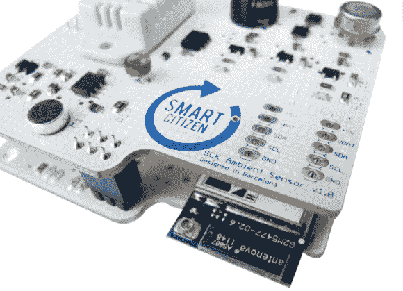

# 智能公民:兼容 Arduino 并装有传感器

> 原文：<https://hackaday.com/2013/09/30/smart-citizen-arduino-compatible-and-packed-with-sensors/>

如果你现在要开发另一个 Arduino 兼容的主板，你也可以采用“厨房水槽”的方法。[智能公民套件将其堆积在](http://www.kickstarter.com/projects/acrobotic/the-smart-citizen-kit-crowdsourced-environmental-m)上，包括 Wi-Fi、SD 卡插槽和底部的 EEPROM。附加的屏蔽物被称为“环境板”，是一个传感器的自助餐:温度，湿度，一氧化碳，二氧化氮，光强和一个读取声音水平的麦克风。该委员会的预期目的是通过从多个智能公民工具包中众包数据来提供一个开源、交互式的环境数据库，但你可以添加自己的东西或完全取消屏蔽。其他的防护罩也正在开发中，旨在提供农业数据、监控生物特征识别等。

把智能公民放在某个地方，它可以通过 WiFi 连接将传感器数据发送到网络上。结果值得一看。[这是散布在欧洲各地的早期发布车型的实时数据图](http://smartcitizen.me/pages/sck),其中大部分似乎是由太阳能驱动的，带有一个小型的脂肪电池，可以让它们整夜运行。还有一个附带的 [iPhone 应用](https://itunes.apple.com/en/app/smartcitizen/id682554291)，可以让你设置智能公民，从附近的传感器检索数据，并允许你将手机的 GPS 位置与你随身携带冲浪板时收集的任何数据进行匹配。

开发人员在今年夏天早些时候实现了他们的 Kickstarter 目标，董事会最近进入了制造过程，在这里翻找他们的 [GitHub 文件](https://github.com/fablabbcn/SmartCitizen.me)，并观看下面的智能公民视频预览。

[https://player.vimeo.com/video/66546502](https://player.vimeo.com/video/66546502)