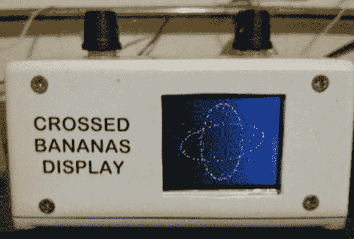

# 基于 Atmega328 的无线电传 XY 示波器显示器

> 原文：<https://hackaday.com/2013/09/30/an-atmega328-based-radioteletype-xy-scope-display/>

[杰克]向我们透露了一个他刚刚设计的交叉香蕉展示(CBD)。CBD 是[频移键控](http://en.wikipedia.org/wiki/Frequency-shift_keying) (FSK)模式的调谐辅助设备，基本上是 [X-Y 模式](http://en.wikipedia.org/wiki/Oscilloscope#X-Y_mode)的示波器。曾几何时，无线电报操作员使用二进制 FSK 通过无线电波传输文本。在这个方案中，“1”被称为标记频率，“0”被称为空间频率。如果两个频率都被完美地调谐(正确的相位),那么结果显示看起来就像上面显示的那样，解释了“交叉香蕉”名称的由来。

该构建基于 ATmega328 和分辨率为 128×160 的 1.8 英寸 ST7735R 显示器。MC33204PG 运算放大器与电位计配合使用，在微控制器 ADC 的范围内调整输入。另一个电位计设置图形的刷新率。整个项目被封闭在一个涂漆的铸铝芽盒中，这个项目的所有资源都可以在这里找到。