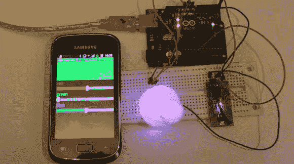

# Android 控制的 RGB 灯

> 原文：<https://hackaday.com/2013/10/01/android-controlled-rgb-lights/>

这里有一个方便的方法来安装一个由 Android 控制、Arduino 驱动的 RGB 灯光设置。

[Kerimil]最近在 Arduino.cc 上写了这个项目，并分享了所有的源代码和计划。虽然我们许多经验丰富的 Arduino 爱好者可以在睡梦中轻松地拼凑出 RGB LED 电路的代码，但[Kerimil]还提供了 Android 应用程序，以及要在 [App Inventor](http://appinventor.mit.edu/) 中修改的源文件，这是一个最初由谷歌发布的 Android 应用程序开发程序，但现在由麻省理工学院维护。

我们已经看到了该产品的许多商业版本，但很高兴看到一个可以很容易地被黑客攻击成我们喜欢的版本。接下来是编写一个应用程序，使用手机的摄像头来识别颜色，并用 LED 再现它们！当你在做的时候，为什么不把它和一个[容易建造的无限镜子](http://hackaday.com/2013/09/04/rgb-infinity-mirror/)混合起来呢！

要查看实际运行的白板和应用程序，请在休息后观看视频。

[https://www.youtube.com/embed/cSDkNptPpYU?version=3&rel=1&showsearch=0&showinfo=1&iv_load_policy=1&fs=1&hl=en-US&autohide=2&wmode=transparent](https://www.youtube.com/embed/cSDkNptPpYU?version=3&rel=1&showsearch=0&showinfo=1&iv_load_policy=1&fs=1&hl=en-US&autohide=2&wmode=transparent)

如果你感兴趣，[Kerimil]已经将所有的源文件存储在 [Google Drive](https://drive.google.com/folderview?id=0B_PfPoEotOF8N2JwT3RSX011SjQ&usp=sharing) 中，所以现在就开始你的 Android RGB 项目吧！

【感谢英特尔！]