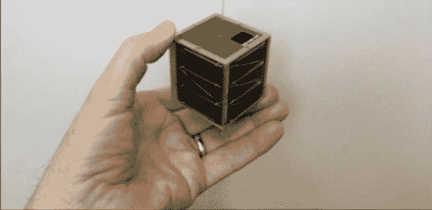

# 口袋量子:甚至比立方体卫星还小

> 原文：<https://hackaday.com/2013/10/02/pocketqubes-even-smaller-than-a-cubesat/>

全球数百个组织和大学已经发射了 100 多颗立方体卫星。这些已被证明在技术演示、地球成像和其他应用中非常有用。然而，立方体卫星平台有一个很大的缺点。尽管它被设计成搭乘更大卫星的发射，但它们的开发和发射仍然非常昂贵——大约在 6 万美元到 12.5 万美元之间。

PocketQubes 是一种新设计的卫星，它将个人卫星的成本降低到大学和业余无线电爱好者实际上可以承受的水平。PocketQube 是一个 5 厘米的立方体，可以花大约 2 万美元发射到 700 公里的轨道上，而不是花 12.5 万美元购买一个 10 厘米的立方体卫星。

已经有四个 PocketQube 计划在 11 月发射到 700 公里的太阳同步轨道，包括由一些业余爱好者组装的小型无线电收发器 [$50SAT](http://www.50dollarsat.info/) ，以及带有 3 轴反应轮和等离子推进器的非常令人印象深刻的 pocket qube[鹪鹩](https://www.youtube.com/watch?v=ilXOZ1A3g5M)。

目前，PocketQube kickstarter 仅用于铝结构，这些铝结构将成为一个 5 厘米立方体小卫星的骨架。还有一家名为 [PocketQube 的商店](http://www.pocketqubeshop.com/)，它提供了这个项目更多的背景信息。