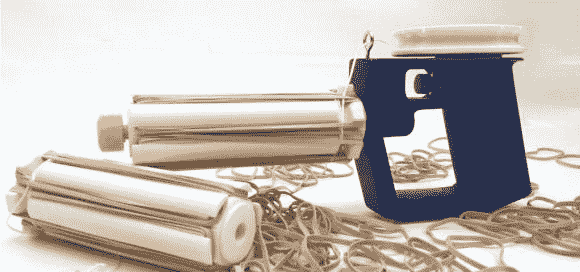

# 橡皮筋爆破手每秒射出 10 发子弹

> 原文：<https://hackaday.com/2013/10/03/rubber-band-blaster-shoots-10-rounds-a-second/>

办公室战争刚刚升级，是时候躲在你的小隔间里了！进入[橡皮筋爆破手-32](http://forums.parallax.com/showthread.php/150484-The-Rubber-Band-Blaster-32-10-rounds-per-second-instantly-reloadable) ，这是一把全自动橡皮筋手枪，配有可切换枪管，可快速重新装弹。

它采用了一种我们以前从未见过的独特的触发释放设计。通过使用拉线释放，[戴夫]发明者能够加载多个橡皮筋每桶单独发射，一个接一个。按住扳机，随着发射轮旋转，你可以开始每秒发射 10 发子弹！

根据[Dave]的说法，装弹时间大约是一分钟一桶，但这些桶可以装起来储存，随时可以使用，所以打包一些弹夹，挂在饮水机后面。这是会计部的比尔最后一次偷我的订书机！

为了看这只小狗的表演，休息后请耐心等待！

[https://www.youtube.com/embed/CEQ0T4qCQKU?version=3&rel=1&showsearch=0&showinfo=1&iv_load_policy=1&fs=1&hl=en-US&autohide=2&wmode=transparent](https://www.youtube.com/embed/CEQ0T4qCQKU?version=3&rel=1&showsearch=0&showinfo=1&iv_load_policy=1&fs=1&hl=en-US&autohide=2&wmode=transparent)

如果这还不足以让你在办公室大战中占上风，我们不知道什么才是！请注意，放一个[自动化的 Nerf 哨兵炮塔总是有帮助的……](http://hackaday.com/2012/07/31/automated-turret-gives-you-the-upper-hand-in-office-warfare/)