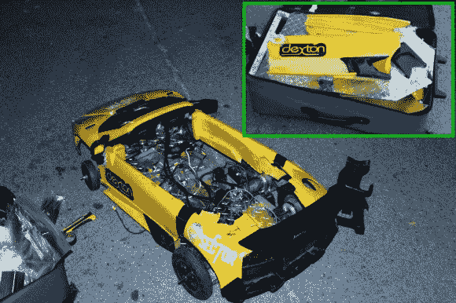

# 这款动力赛车系列如何登上飞往 WMF 的飞机

> 原文：<https://hackaday.com/2013/10/04/how-this-power-racing-series-car-on-a-plane-to-wmf/>

你真的应该看看当地黑客空间的月度会议。这是一个听最有趣的故事的绝佳机会。就像 67 区的人把电动车带上飞机的故事。它不仅飞上了天空，而且他们没有提前计划如何实现它。

[Bob Baddeley]在世界创客大会上发布了一张关于中国经历的相册。有些文字说明在一定程度上讲述了这个故事，但我们会尽最大努力让你了解 hackerspace 的第二辆车背后的故事，这款车被亲切地称为 Lamebourghini。

车辆的“包装”直到第 67 区第 67 队计划出发去机场的时候才开始。他们的主要车辆已提前装运，但当它被装箱时，这仍是团队成员眼中的一线希望。它被拆卸的方式会给大城市的拆车厂留下深刻印象。身体的大部分和部分被塞进一个大箱子里，站在盖子上让拉链一直拉上。

其余的部分被带走了，听起来就像一场机场安检噩梦。你不能托运锂电池，但显然你可以随心所欲地携带，没有任何限制。除了发动机上的电池，塑料机身的鼻锥，以及两块没有放进行李箱的锯齿状角铁。

组装是一个挑战——这是真正的黑客一起。意识到没有合适的刹车是无法进入的，克雷格在纽约的清单上买了一辆自行车，作为廉价的捐助者来满足这一要求。最后，它与 Fauxrarri 赛车一起比赛，这让 time 获得了三连冠。

如果你仔细看，你会发现我们自己的[布莱恩·班考夫]驾驶获胜车辆的测试。