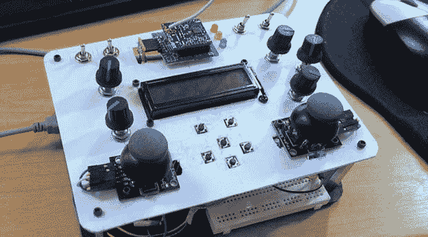

# 控制机器人和四轴飞行器的 DIY 解决方案

> 原文：<https://hackaday.com/2013/10/04/a-diy-solution-for-controlling-robots-and-quadcopters/>

用于控制机器人、四轴飞行器、飞机和汽车的 RC 发射器其实并不复杂。有几个开关，几个锅，一个屏幕和一个无线电发射机。maker toolbox 已经有了所有这些组件，所以有人试图[建造他们自己的 RC 发射器](http://blog.oscarliang.net/diy-wireless-rc-remote-controller-for-robots/)才有意义。

[Oscar]的项目从收集一堆拨动开关、2 轴操纵杆、pots、轻触开关、Arduino、LCD 和 Ciseco XRF 无线模块开始。它们被固定在由聚苯乙烯制成的面板上，通信协议的工作开始了。

需要注意的是，采用 XBees 的微控制器供电 RC 发射器并不新鲜。去年有一个 Kickstarter，但最终产品结果是有点 janky，充满了故障布线，我们真的很高兴看到[Oscar]在 DIY RC 发射器方面的尝试，希望我们能看到这个项目被其他人接受和改进。

[https://www.youtube.com/embed/8jNj_kf5VD4?version=3&rel=1&showsearch=0&showinfo=1&iv_load_policy=1&fs=1&hl=en-US&autohide=2&wmode=transparent](https://www.youtube.com/embed/8jNj_kf5VD4?version=3&rel=1&showsearch=0&showinfo=1&iv_load_policy=1&fs=1&hl=en-US&autohide=2&wmode=transparent)