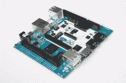
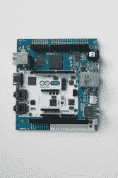
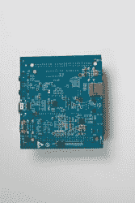
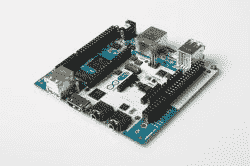

# 当 Arduino 遇到 Beagle Bone

> 原文：<https://hackaday.com/2013/10/04/tre-when-arduino-meets-beagle-bone/>

尽管昨天发布了基于 x86 的 Arduino，由英特尔芯片驱动。这可能不是(马西莫)在罗马创客节上讲的大故事。与 x86 Arduino Galileo 一起发布的[是 Arduino TRE，](http://arduino.cc/en/Main/ArduinoBoardTre)是 Arduino 和 BeagleBoard 基金会的合作项目。

TRE 实际上是两个 Arduino 的结合:中间是一个 Arduino Leonardo，带有标准的 Arduino 接口和一个 ATmega32u4。板上的其他地方是 TI Sitara ARM Cortex A-8 处理器，运行速度为 1GHz，具有 512 MB RAM，10/100 以太网，HDMI 输出，USB 主机和设备端口，以及一系列用于 LCD 和 ZigBee 的连接器。

当然，TRE 和树莓派之间有明显的相似之处。在硬件方面，TRE 非常接近于比格涅黑(T1)，比树莓 Pi 更强大，能够做一些 Pi 无法处理的非常酷的事情(例如 OpenCV)。

我认为，Arduino TRE 还没有正式的价格。不过，它将于 2014 年春季上市。你可以在下面的图库中查看所有的新闻稿照片。

