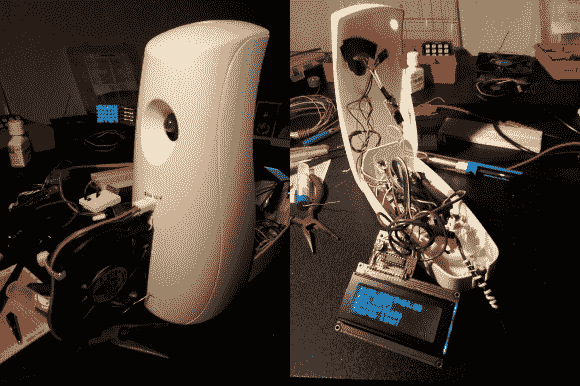

# 湿度激活浴室风扇

> 原文：<https://hackaday.com/2013/10/06/humidity-activated-bathroom-fan/>

[Andrea]最近和他的几个朋友搬进了公寓。不幸的是，浴室缺少一个最重要的东西——风扇。或者至少是一扇窗户！

利用空气清新剂、简单的 DHT11 湿度/温度传感器、LCD、12V 风扇和 ATmel328 微控制器，[他创造了这个方便的小工具](http://www.area51staff.it/humiditycontrol/)。

当浴室中的湿度超过 50%阈值时，LED 会闪烁，提示用户开门。短暂的延迟后，其中一个晶体管翻转，导致潮湿的空气循环出房间。

我们很惊讶这个 12V 的小风扇有足够的能量来清理房间，但显然它很有帮助，可以在不到 20 分钟内清理房间。

为了看到它的实际效果，请在休息后留下来。

[https://www.youtube.com/embed/RY9EglMU-Sg?version=3&rel=1&showsearch=0&showinfo=1&iv_load_policy=1&fs=1&hl=en-US&autohide=2&wmode=transparent](https://www.youtube.com/embed/RY9EglMU-Sg?version=3&rel=1&showsearch=0&showinfo=1&iv_load_policy=1&fs=1&hl=en-US&autohide=2&wmode=transparent)

虽然这不是第一个智能浴室传感器！我们去年报道过一个[项目，它使用了非常相似的设置](http://hackaday.com/2012/11/19/bathroom-fan-that-switches-itself-on-when-it-gets-steamy-or-smelly/)。