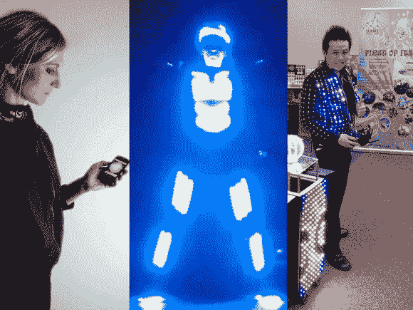

# LED 服装和服饰

> 原文：<https://hackaday.com/2013/10/06/led-costumes-and-clothing/>

我们的 tips 系列最近收到了大量可穿戴 LED 项目，包括休闲和职业装。[Elizabeth]和[Luis]创造了 [Lüme 可穿戴系列](http://jorgeandesther.com/lume/)，旨在通过给夹克、t 恤和连衣裙添加可调节的强调色来进行装饰。这些电子设备是定制的，围绕 ATMega32u4 构建，每个都有蓝牙功能，可以与用户的手机进行交互。从手机上，你可以改变颜色、序列、设置事件，甚至利用“墨水滴管风格”的功能，将 led 的颜色与你的相机指向的任何对象相匹配。

[Michal 的]项目是一个名为“Tron Dance”的舞蹈和激光表演的整套[服装，它使用几个 RGB LED 灯条放置在穿着者服装的关键点上。看起来[Michal]有意避开关节区域，以防止断裂或弯曲的任何问题，但仍然设法放置足够的位置来覆盖整个身体。我们不确定是什么控制了一切，但你可以看到它经历了各种序列，并在休息后的舞台表演中幸存下来。](https://www.youtube.com/watch?v=aqH6q5SP_hs)

最后，在另一种表演中，魔术师[Kiki Tay]制作了一件布满 RGB led 的[夹克。[Kiki]想要可穿戴的 LED 控制，可以在各种情况下使用，而不必每次都重新发明轮子，所以他开发了自己的板——](http://www.kikitayblog.com/2013/07/kiki-tays-led-costume-part-2.html)[LED 魔术师](http://www.ledmagician.com/):Arduino 兼容的解决方案。该板有 12 个输出通道，每个通道驱动 50 多个 led，并具有 12 个板载 led，可显示输出预览。为了使互动更加人性化，[Kiki]提供了 32 个内置序列和可调速度，用户可以通过板上的 4 个按钮进行编程。如果这还不够控制，还有一些外部控制的选项。这件夹克本身使用的是一个业余爱好的脂肪电池，而且非常明亮:休息后留下来看视频。

吕梅系列:

[https://www.youtube.com/embed/33w8oNFmTCs?version=3&rel=1&showsearch=0&showinfo=1&iv_load_policy=1&fs=1&hl=en-US&autohide=2&wmode=transparent](https://www.youtube.com/embed/33w8oNFmTCs?version=3&rel=1&showsearch=0&showinfo=1&iv_load_policy=1&fs=1&hl=en-US&autohide=2&wmode=transparent)

创舞:

[https://www.youtube.com/embed/VJsTTjdFYjI?version=3&rel=1&showsearch=0&showinfo=1&iv_load_policy=1&fs=1&hl=en-US&autohide=2&wmode=transparent](https://www.youtube.com/embed/VJsTTjdFYjI?version=3&rel=1&showsearch=0&showinfo=1&iv_load_policy=1&fs=1&hl=en-US&autohide=2&wmode=transparent)

[https://www.youtube.com/embed/aqH6q5SP_hs?version=3&rel=1&showsearch=0&showinfo=1&iv_load_policy=1&fs=1&hl=en-US&autohide=2&wmode=transparent](https://www.youtube.com/embed/aqH6q5SP_hs?version=3&rel=1&showsearch=0&showinfo=1&iv_load_policy=1&fs=1&hl=en-US&autohide=2&wmode=transparent)

Kiki Tay 的夹克:

[https://www.youtube.com/embed/pbqH_z9paks?version=3&rel=1&showsearch=0&showinfo=1&iv_load_policy=1&fs=1&hl=en-US&autohide=2&wmode=transparent](https://www.youtube.com/embed/pbqH_z9paks?version=3&rel=1&showsearch=0&showinfo=1&iv_load_policy=1&fs=1&hl=en-US&autohide=2&wmode=transparent)