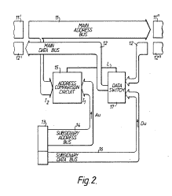
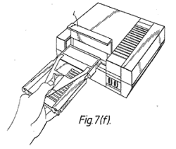

# 游戏精灵如何工作

> 原文：<https://hackaday.com/2013/10/07/how-the-game-genie-works/>

我们这些年龄足够大的人可能还记得吹弹夹的游戏精灵——一种插入 NES、SNES、世嘉创世纪或游戏机的设备，它给玩家提供额外的生命、物品、改变难度或修改游戏玩法。对于一个还不知道《超级马里奥兄弟》第一关的人来说，游戏精灵似乎很神奇。当然，精灵和[强大的麦克大师]一起对游戏精灵如何工作进行了一次伟大的演练，这背后有一个韵律和原因。

有两种游戏精灵代码——6 字符代码和 8 字符代码。这两种类型的代码都转换为游戏 ROM 中的 15 位地址(对于基于 6502 的 NES，从 0x8000 到 0xFFFF)和一个数据字节。对于 6 字符代码，每当访问游戏精灵代码引用的地址时，都会返回一个特定的数据字节。因此，只要一个 6 个字符的代码，无限的生命就成为了现实。

一些游戏，尤其是在各自系统的晚期制作的游戏，使用内存映射来增加卡带上提供的代码和数据。由于数据区域不断地进出 CPU 的地址空间，所以每当访问一个特定的地址时，仅仅返回一个设定值将是灾难性的。对于这种银行转换设置，游戏精灵使用 8 位代码；它就像 6 位代码一样，只是增加了一个“比较”字节。使用 8 位代码，如果比较字节相等，游戏精灵返回一个特定的字节。否则，精灵会将原始数据交给 CPU。

当然，所有这些信息都可以从游戏精灵的原始专利中收集到。至于游戏精灵内部的电路，除了一个不可谷歌的 [GAL](http://en.wikipedia.org/wiki/Generic_array_logic) (通用阵列逻辑)和一个微型环氧树脂微控制器之外，真的没有什么。这是一个非常简单的装置，让我们年轻而敏感的头脑充满了惊奇。

[via [Reddit](http://www.reddit.com/r/programming/comments/1nqyz5/til_how_the_game_genie_for_nes_works/)