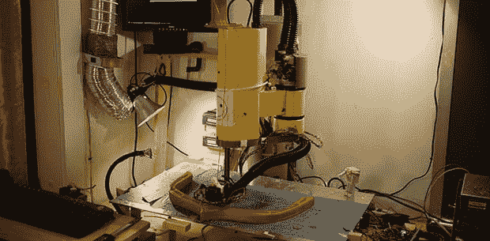

# SCARA 手臂变成巨大的 3D 打印机

> 原文：<https://hackaday.com/2013/10/09/scara-arm-becomes-enormous-3d-printer/>

当你在实验室里发现一个废弃的 80 年代 SCARA 手臂时，除了用它做一个巨大的 3D 打印机，你真的没什么可做的。

上次我们看到[戴恩]的[抢救 SCARA 的手臂](http://hackaday.com/2012/06/19/salvaged-robot-arm-makes-a-big-3d-printer/)时，他已经通过构建自己的伺服电机控制器和反馈传感器重建了电子设备。有一些最初的测试打印，但这台打印机的新升级使它更有用，使它看起来更拼凑，并使打印更准确。

新机器的最大升级是更新的加热构建板。前一个板使用六个 30W 电阻。够好了，但通过两个额外的 245W 薄膜加热器，[Dane]现在可以将他的构建板保持在恒定的 65 摄氏度。保持如此大面积的温暖需要一个加热的构建室，所以[Dane]想出了一个由铝挤压件、激光切割部件和丙烯酸框架制成的巨型半六边形盒子。

与早期的打印相比，SCARA 手臂正在打印一些非常漂亮的零件，包括一个容纳 40 节磷酸铁锂电池的电池座，以及一个 3D 打印船的漂亮螺旋桨。这是一个令人印象深刻的构建，更令人印象深刻的是，这个机械臂是在一次实验室清理中发现的。