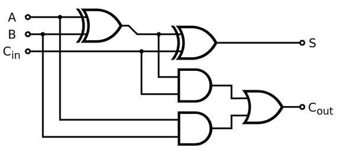

# 使用 C 预处理器创建一个全加器

> 原文：<https://hackaday.com/2013/10/09/create-a-full-adder-using-the-c-preprocessor/>



[Phillip]想玩 C 预处理器。他决定通过[创建一个 4 位全加器](http://www.philliplarkson.com/blog/abusing-the-c-preprocessor-writing-a-4-bit-adder)来做到这一点。我们知道这在日常生活中毫无用处，但这是一次很好的学习经历。这个加法器的美妙之处就在一开始。[Phillip]定义了 XOR 和 and 的真值表。他能够创建引用这些真值表的字符串。
比如:【菲利普的】和表的第一行是#define 和 _00 0。如果预处理程序将等于“AND_00”的字符串连接起来，那么它们将被转换为 0。这是半加法器的基础。

下一步是操作逻辑，这当然取决于宏:

```

/* Full adder macros */
/* Out = (A ^ B) ^ cin */
#define FULL_ADD_OUT( a, b, cin ) \
 XOR( XOR( a, b ), cin )

/* Carry_out = (A &amp; B) ^ (Carry_in &amp; (A ^ B)) */
/* The standard adder uses OR for the last 'gate' - this
 can safely be changed  to XOR, which has been done here
 to avoid defining an OR operator */
#define FULL_ADD_CARRY( a, b, cin ) \
 XOR( AND( XOR( a, b ), cin ), AND( a, b ) )

```

上面这段预处理器代码根据 AND 和 XOR 定义了传统全加器逻辑。这就是加法器本身的逻辑。下一步是将四位加法器连接在一起。更多位是可能的，但是代码会变得相当混乱。

菲利普表演的最后一个魔术是将十进制数转换成二进制数。为了实现这一点，他使用了与 XOR 和 and 相同的连接技巧。最终的结果是一个程序，它可以接受两个数字作为预处理选项，并编译一个二进制文件，当它运行时，总是将这两个数字相加。就像我们说的——它本身并不十分有用，但却是学习一些 C 预处理器技巧的好方法，将来肯定会派上用场。