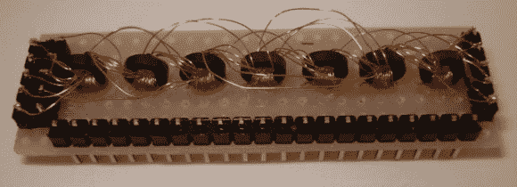

# 制作核心绳只读存储器

> 原文：<https://hackaday.com/2013/10/09/making-a-core-rope-read-only-memory/>

[Kos]向我们透露了他写的一篇文章，介绍了他在设计和实现[核心绳存储器](http://qrp.gr/coreROM/)方面的经验。这种磁性只读存储器(ROM)与普通的重合电流磁芯存储器(用于 RAM)相反，使用铁氧体磁芯作为变压器。如果你看上面的图片，你会数出其中的 7 个。这设置了存储器字长(7 位)。一个新单词通过(或不通过)一根导线穿过铁氧体孔而被加入到存储器中。如果将交流电通过这根导线，在另一根绕铁氧体(别名变压器次级)旋转 30 圈的导线中将会感应出(或不感应出)电流。

在[Kos]的设置中，5V 的输入脉冲产生 15V 的输出脉冲。为了演示的目的，他“编写”了一个简单的程序，在一个七段显示器上点亮数字。因此，根据他使用哪根导线来传递交流电，不同的数字会亮起。

如今，核心内存黑客已经少之又少。但是看看这个，还有我们在八月看到的那个，会让我们想要更多。如果你知道任何其他人，不要犹豫[给我们一个提示](http://hackaday.com/contact-hack-a-day/)。