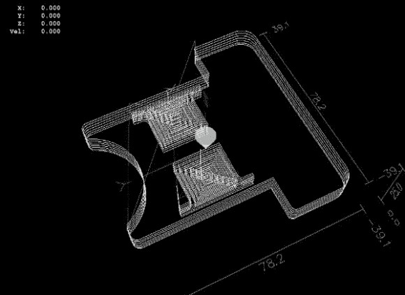

# 仅使用开源软件的 CNC 软件工具链

> 原文：<https://hackaday.com/2013/10/12/cnc-software-toolchain-using-only-open-source-software-2/>

对于业余爱好者来说，有两种类型的机器可以在家里制造零件。第一种是物质加法机(3D 打印机)，另一种是物质减法机(像数控铣床)。[Mario]最近向我们透露了[他写的一篇文章](http://www.thebitbangtheory.com/2012/01/cnc-software-toolchain-linux/)详细介绍了哪些自由软件可以用来在数控机床上设计和生产零件。

该过程的第一步显然是使用计算机辅助设计(CAD)应用程序设计您想要制造的零件。[马里奥]建议使用 [Heeks](http://heeks.net/) 或 [Freecad](http://www.freecadweb.org/) ，你可以在 YouTube 上找到大量相关教程。下一步是使用计算机辅助制造(CAM)应用程序将你刚刚设计的零件转换成加工刀具轨迹。幸运的是，Heeks 可以做到这两点，所以它可能是初学者的最佳选择。[Mario]还提到了[的 pcb2gcode](http://sourceforge.net/apps/mediawiki/pcb2gcode/index.php?title=Main_Page) 应用，它允许你在家里为你可能想要生产的原型制造印刷电路板。最后，众所周知的 [LinuxCNC](http://www.linuxcnc.org/) (以前的 Linux EMC2)软件被用于使用 CAM 软件产生的 GCode 控制 CNC 机器。

在 Hackaday，我们真的很想知道我们的读者目前使用什么作为他们的 CNC，所以不要犹豫，在下面给我们留下评论。