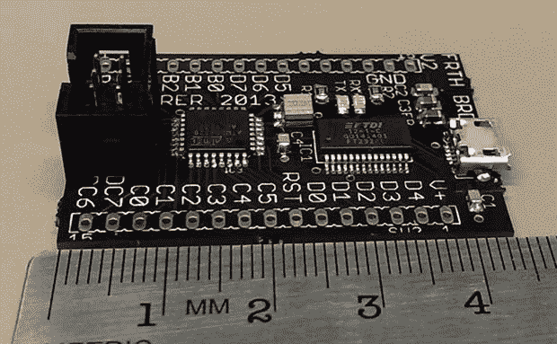

# 一个简单的 Forth 开发板

> 原文：<https://hackaday.com/2013/10/12/a-simple-forth-development-board/>

Forth 是一种非常有趣的编程语言。它非常灵活，在低功耗硬件上效率极高，但不幸的是，它并不流行，原因很简单，它并不流行。20 世纪 80 年代制造了一些基于 Forth 的微型计算机，但大多不成功。

[Leon]是一个 Forth 爱好者，他想出了自己的 Forth 开发板,希望 Forth 能够东山再起。这是一个非常小而便宜的板——零件价格仅为 12 美元——但它仍然非常强大，是一个研究 Forth 的有趣平台。

与 80 年代微型计算机中的其他编程语言相比，Forth 实在是太怪异了。它是一种基于堆栈的语言，所以 Forth 使用后缀符号(或[反向波兰符号](http://en.wikipedia.org/wiki/Reverse_polish_notation))而不是像 3 + 4 那样将两个数字相加，所以同样的语句被表示为 3+4。对于计算机来说，这是一种更有效的处理数据的方式，一些人声称这对人类来说也更有效。

[Leon]创建了他自己的能够在 Forth 中编程的板，如上所示，它使用 ATMega328 微控制器。他正在使用 [AmForth](http://amforth.sourceforge.net/) 在他的系统上发布，但也用他自己的浮点版本扩展了基础 AmForth 安装[。](https://github.com/lnmaurer/amforth-float)使这个版本的 Forth 至少与今天的任何 80 年代微型计算机或 ATMega 开发板一样强大。

[Leon]制作了一个关于 Forth 及其开发板功能的精彩演示。你可以看看下面。

[https://www.youtube.com/embed/gFE6oK7jkq4?version=3&rel=1&showsearch=0&showinfo=1&iv_load_policy=1&fs=1&hl=en-US&autohide=2&wmode=transparent](https://www.youtube.com/embed/gFE6oK7jkq4?version=3&rel=1&showsearch=0&showinfo=1&iv_load_policy=1&fs=1&hl=en-US&autohide=2&wmode=transparent)