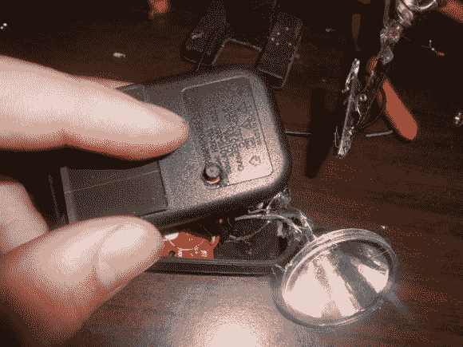

# 将太阳能庭院灯改装成手电筒

> 原文：<https://hackaday.com/2013/10/12/hack-a-solar-garden-light-into-a-flashlight/>

在逛当地的一元店时，[泰勒]发现了一块看起来可疑的石头，仔细一看，原来是太阳能花园灯。他把它捡起来，带回家，砸开，改装成手持太阳能手电筒。

里面是一个小得可怜的 40mAh 可充电电池，他将其升级为更标准的可充电 AA 电池。garden rock 预装了自己的升压转换器来提升 LED 的电压，但它相当暗。我们猜测[Taylor]并没有对转换器进行逆向工程，而是简单地进行了一些尝试和错误，但他通过添加不同值的电感来增加 LED 的亮度。

尽管用石头做手电筒可能很有趣，但[Taylor]决定用一个备用的 USB 充电器拼凑一个定制的盒子，制作一个电池座并添加一个按钮。结果是一个方便的太阳能手电筒，充电大约需要五个小时。看看其他一些定制灯:[一个锂动力 PVC 手电筒](http://hackaday.com/2012/05/14/recycle-lithium-cells-by-building-custom-flashlights/)或者一个有着[更光滑的铝制主体和可互换头部的手电筒](http://hackaday.com/2012/04/27/a-flashlight-for-any-occasion/)。