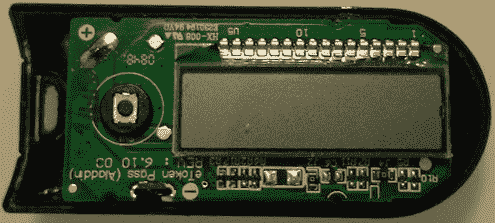

# 在廉价的一次性密码令牌上运行自定义代码

> 原文：<https://hackaday.com/2013/10/15/running-custom-code-on-cheap-one-time-password-tokens/>

一次性密码(OTP)在美国经常使用，但在欧洲不常用。对于我们不熟悉的读者来说，如上所示的 OTP 令牌生成的密码只对一次登录会话或交易有效，这使得它们不会受到重放攻击。[Dmitry]拆卸了他放在周围的一个 eToken (Aladin PASS ),并根据自己的需要对其进行了重新编程。

很明显，这种设备没有原理图和布局文件，所以[Dmitry]不得不做一些逆向工程。他在印刷电路板上发现了 6 个 3×2 排列的孔，所以他认为这些孔一定是用来对设备重新编程的。然而，[Dmitry]还必须找到电路板上的微控制器，因为它唯一的标记是带有微芯片标志的“HA4450”。通过交叉引用微芯片参数搜索工具上的引脚、封装和外围设备的数量，他推断这是一个 PIC16F913。从那时起，他可以在液晶显示器上显示他想要的东西只是时间问题。

我们喜欢看到小型消费类硬件被这样黑掉。最近，我们被 Trandscend Wi-Fi SD 卡黑客攻击迷住了，这也是[Dmitry]的黑客攻击之一。