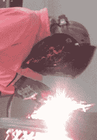

# 嘉宾咆哮:从比特到原子

> 原文：<https://hackaday.com/2013/10/18/guest-rant-from-bits-to-atoms/>

我做软件开发已经有一段时间了。当你在一个特定的世界里呆的时间足够长时，很容易就会变得视野越来越狭窄。你开始从软件的角度看待一切。俗话说，当你唯一的工具是锤子的时候，你往往会把每一个问题都当成 NP-Complete。或者什么的。我忘了那是怎么回事了。

不管怎么说，关键是，开阔一个人的视野总是好的，尽可能多地解决不同类型的问题。为此，我最近开始涉足电子爱好。这次旅行在很多方面都很有启发性。

首先我了解到硬件和软件真的没有那么大的区别。同样的工程设计和调试原则也适用。当设计一个复杂的硬件系统时，你使用与大型软件系统相同的基本方法。您将它分解成越来越小的组件，直到所有的部分小到可以单独实现和验证。然后，您开始实现各个部分，连接它们，并调试由于这些交互而出现的问题。渐渐地，你得到了一个复杂的实体，它可以运行，但是太大了，不能一下子理解。

第二，我了解到硬件人员有更酷的工具(比如，带闪光灯之类的)。他们中的一些人制造噪音。他们中的一些是热的或锋利的。

在生产软件工程中，硬件可以说有更多被认为是“硬错误”的东西。这些是难以重现的错误，或者是非确定性的行为。这些类型的问题在大型系统、实时系统和多线程系统中很常见。一个有经验的软件开发人员已经遇到并解决了许多这样的问题，通常在一个 bug 上花费数天或数周的时间。幸运的是，这些知识非常适合硬件调试。这并不是说硬件开发比软件开发更难。我认为他们在这方面是平等的，但挑战往往存在于不同的领域。

好的软件工程很大程度上是关于最小化硬件错误。一个设计良好的系统将经历更少的内存泄漏、更少的死锁、更少的竞争条件等等。硬件是一个充满交流噪声、电磁干扰、静电、寄生电容和各种其他随机现象的世界，这些现象会给调试带来困难。与软件类似，许多好的硬件设计都是为了最小化这些影响。

最后，我学到了硬件可以带来极大的满足感，因为当你完成时，你最终会得到一些可以拿在手中的东西。别误会，我爱写软件。然而，它确实存在一个问题，即你所做的一切都转瞬即逝。例如，我回想起我在小学花在项目上的数百个小时。那些游戏和演示现在都没有了，可能永远没有了。软盘理论上仍然在我妈妈的地下室，但他们现在很可能是不可读的。现代代码仍然有同样的问题，只是形式不同。当然，随着互联网和不断的迁移，代码本身可以永远存在。然而，如果不经常维护，它所依赖的所有语言层、SDK、库和驱动程序都会过时。向后兼容性有一个窗口，如果不跟上，代码会滑出这个窗口。在那一刻，它停止运作。软件总是转瞬即逝。

也许接受努力工作进入稍纵即逝的事物的想法是硬件和软件人之间的区别。软件人员习惯于“虚拟地”思考，并且很久以前就接受了这样的想法:当一个项目完成时，它被推到一边，也许被遗忘，所有的焦点都放在下一件事情上。

这是探索硬件/软件鸿沟的绝佳时机。微控制器和友好的开发板模糊了软件之间的界限。进入另一边的门槛一直在降低。所以，如果你是一个软件人，试着弄脏你的手，扔一点通量。如果你是一个硬件人员，尝试一下遗传算法、探路者或快速排序。你可能会惊讶于另一半人的生活有多棒。

* * *

 作者简介:

[奎因·邓基]做游戏 32 年了，最后 17 年都是职业的。她最近是流行病工作室的人工智能建筑师，在动态开放世界的标题“破坏者”。她现在从事咨询、独立开发、混合媒体工程项目和写作。她有一家名为 One Girl，One Laptop Productions 的移动软件公司和咨询公司，为 iOS、Android、Mac 和 PC 制作游戏和其他应用程序。闲暇时，她拍照、[赛车、](http://hackaday.com/2012/03/29/808-camera-hack-produces-a-time-lapse-tic-tac-box/)、[破解电子产品、](http://hackaday.com/2013/03/31/building-ram-into-veronica-the-6502-computer/)[组装电脑、](http://hackaday.com/2013/07/06/veronica-6502-gets-keyboard-input-via-usb/)，并讽刺地斥责她的朋友。

[http://www.quinndunki.com](http://www.quinndunki.com/)

[http://www.quinndunki.com/blondihacks](http://www.quinndunki.com/blondihacks)