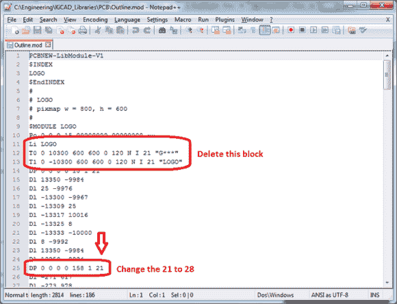

# 在 KiCad 中创建不规则电路板轮廓

> 原文：<https://hackaday.com/2013/10/15/creating-irregular-board-outlines-in-kicad/>

纯文本文件格式的一个好处是你可以手动编辑它们。这是[Clint]在最近的一篇文章中提到的 KiCad board outline hack 的一部分。他想要一个独特的电路板轮廓，这是 KiCad 不一定适合的。他的解决方案是将轮廓创建为图像，然后导入它。如果你想知道这种类型的工作需要什么样的定制形状，我们将为你介绍一种[开瓶器。该 PCB 布局是在 Eagle 上完成的，对于特殊形状有更多的余地。](http://hackaday.com/2013/10/11/haduino-open-your-beer-using-arduino/)

在进入上面看到的代码编辑步骤之前，[Clint]使用了 KiCad 的内置功能，该功能会将图像转换为组件。他导出该代码，并使用文本编辑器对其进行修改，以便将形状的图层设置更改为电路板轮廓的图层设置。这使他从一个普通的旧图像变成了一个可以选择并放入电路板编辑程序的模块。如果你有兴趣用你疯狂的图形编辑技巧在覆铜上设计一件艺术品，那么为铜层做这种事情也是轻而易举的。