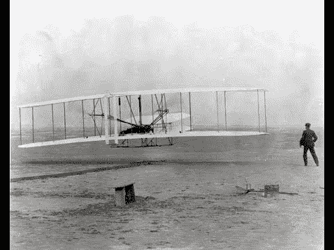

# 怀旧:莱特兄弟的迷你剧

> 原文：<https://hackaday.com/2013/10/15/retrotechtacular-miniseries-on-the-wright-brothers/>

诚然，我们更喜欢我们的复古视频是 campy，但有时内容太酷了，我们不得不放弃这个目标。莱特兄弟的第一次载人动力飞行系列也是如此。

现在有一些关于谁真正第一次在地球上飞行的争论。通过分享用于证实该主张的基准，马上触及到了这个问题:

*   这台机器比空气重
*   抬着一个人
*   在自己的力量下从地面升起
*   在控制下飞行，没有失去速度
*   在不低于起飞高度的高度安全着陆

这两部连续剧播出将近两个小时。但是图像、视频片段和第一手资料的结合创造了一些令人难以置信的有趣的东西。最初的飞行发生在 110 年前的今年 12 月。这似乎不是很久以前的事了，令人难以置信的是，空中旅行现在在发达国家很普遍，我们甚至看到了人力飞行的进步，这本身就像莱特兄弟所做的一样具有开拓性。

[https://www.youtube.com/embed/9-9GKUXd9gg?version=3&rel=1&showsearch=0&showinfo=1&iv_load_policy=1&fs=1&hl=en-US&autohide=2&wmode=transparent](https://www.youtube.com/embed/9-9GKUXd9gg?version=3&rel=1&showsearch=0&showinfo=1&iv_load_policy=1&fs=1&hl=en-US&autohide=2&wmode=transparent)

[https://www.youtube.com/embed/8x--j0CMy80?version=3&rel=1&showsearch=0&showinfo=1&iv_load_policy=1&fs=1&hl=en-US&autohide=2&wmode=transparent](https://www.youtube.com/embed/8x--j0CMy80?version=3&rel=1&showsearch=0&showinfo=1&iv_load_policy=1&fs=1&hl=en-US&autohide=2&wmode=transparent)

[谢谢戴夫]

Retrotechtacular 是一个每周专栏，以旧时的黑客、技术和媚俗为特色。通过[发送您对未来分期付款的想法](mailto:tips@hackaday.com?Subject=[Retrotechtacular])，帮助保持新鲜感。