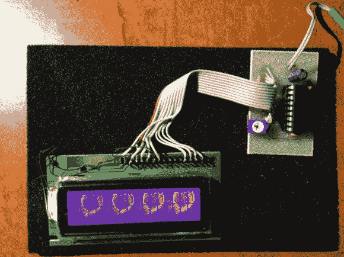

# 教一台旧液晶显示器新招

> 原文：<https://hackaday.com/2013/10/16/teach-an-old-lcd-new-tricks/>

[Art]已经用字符液晶显示器做了一些惊人的工作。他从一个经典的字符液晶显示器开始。这些液晶显示器通常由日立 HD447XXX 兼容控制器控制。日立的控制器允许定义几个自定义字符。我们在过去的应用程序中使用过这些字符，比如旋转器和条形图。[艺术]把事情带到了一个全新的水平。他创建了一个双缓冲 LCD 图形库，允许这些旧 LCD 执行通常为图形 LCD 保留的技巧。更令人印象深刻的是，整个系统运行在一个主要用 PICBASIC 编程的微芯片 PIC16F628A 上。

根据 PICBASIC 论坛上[【Art 的】帖子，他正在使用自定义字符内存作为帧缓冲区。LCD 设置为显示所有 8 个自定义字符。然后，每一帧都在 PIC 的 RAM 中。然后，完成的帧被推送到日立 LCD 控制器的自定义字符存储器中。结果是 LCD 上非常平滑的更新速率。[Art]用一个令人想起 C64 演示场景的视频包装了整个例子。](http://www.picbasic.co.uk/forum/showthread.php?t=18416&p=122492)

这个库有一些限制。字符之间的像素仍然无法显示，并且库不会检查所有边界条件。即便如此，这也是将经典硬件推向新高度的巨大努力。我们希望看到这个库的一个版本在 Microchip 自己的 MPLAB/XC8 工具中移植到 C 上。

[https://www.youtube.com/embed/1xq8xJqbkNA?version=3&rel=1&showsearch=0&showinfo=1&iv_load_policy=1&fs=1&hl=en-US&autohide=2&wmode=transparent](https://www.youtube.com/embed/1xq8xJqbkNA?version=3&rel=1&showsearch=0&showinfo=1&iv_load_policy=1&fs=1&hl=en-US&autohide=2&wmode=transparent)