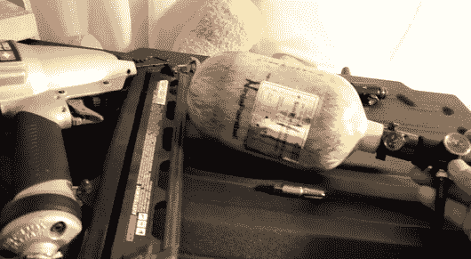

# 使用气动工具实现移动

> 原文：<https://hackaday.com/2013/10/16/going-mobile-with-your-air-tools/>

如果你曾经在工作场所之外使用过气动工具，你就会知道，当你离压缩机越远，拖着空气软管到处跑会越来越烦人。[head explosive][发布了一个视频](http://youtu.be/JVaI-sGlahA)(在休息后嵌入)，展示如何使用 air 工具移动。

为彩弹制造的空气罐在一个微小的空间内是高压的，并且是一种非常方便的能源。在这种情况下，[爆头]使用了一个 68 立方英寸，碳纤维包裹的坦克额定 4500 磅/平方英寸。正常的调节器只能将压力降低到 800 磅/平方英寸，所以他增加了第二个调节器来达到气动工具所需的 120-140 磅/平方英寸。然后，他连接了一根“远程管线”，或一根盘绕的高压软管，并在末端添加了一个标准气动工具连接器。

产量相当可观。在油箱半满的情况下，他设法钉了 100 颗两英寸长的钉子。[爆头]手边有一个水肺罐，用它给彩弹罐充能。他估计，一个潜水箱可以让你用射钉枪射击大约 2000 次，充电只需 7.5 美元。一点也不差。我们不禁想知道你多久能脱离气动切割轮，甚至是锤钻。虽然这些零件并不特别便宜，除非你买二手的，但如果你需要的话，它仍然会在方便的时候为自己买单。

[https://www.youtube.com/embed/JVaI-sGlahA?version=3&rel=1&showsearch=0&showinfo=1&iv_load_policy=1&fs=1&hl=en-US&autohide=2&wmode=transparent](https://www.youtube.com/embed/JVaI-sGlahA?version=3&rel=1&showsearch=0&showinfo=1&iv_load_policy=1&fs=1&hl=en-US&autohide=2&wmode=transparent)