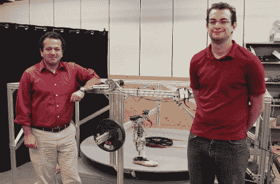

# 假腿自带正常步态！

> 原文：<https://hackaday.com/2013/10/17/artificial-leg-comes-with-a-normal-gait/>

你知道吗，超过 50%的截肢者由于假肢活动受限，每年至少跌倒一次。相比之下，65 岁以上的老年人只有三分之一左右！

[莫·拉斯特加尔教授]和他的博士生[伊万德罗·菲坎哈]着手解决这个问题，他们发明了一种由微处理器控制的假脚,坦率地说，能够正常行走。

通过与来自梅奥诊所的科学家合作，这两人发明了一种假肢，这种假肢使用传感器来主动调整脚踝，以创造正常的步幅。商业上可用的假肢也可以做到这一点，但只能在上下运动中调整脚，这很好——如果你只打算走直线的话。除了可以根据传感器反馈左右和前后滚动的脚踝外，他们还使用电缆驱动系统将控制机制移动到腿上，这减轻了脚部的重量，使其更容易使用。

我们发现测试仪器几乎和假体本身一样有趣。研究人员必须想出一种方法来测量假肢在弧形行走时的性能。解决方案是上面看到的转盘跑步机。

如果你有时间，看看主文章页面上的视频演示，它涵盖了腿部和跑步机的构建。

[via [Reddit](http://www.reddit.com/r/gadgets/comments/1oiwb8/stepping_out_in_style_researchers_developing_an/)