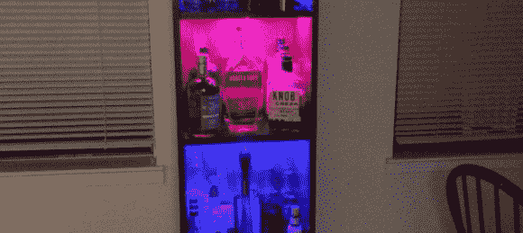

# Interactive Boozeshelf 是它自己的舞会

> 原文：<https://hackaday.com/2013/10/17/interactive-boozeshelf-is-its-own-dance-party/>

[Jeremy]拒绝选择传统的酒精储存方式，而是创造了一个酒架。像大多数家具一样，Boozeshelf 最初是宜家的基本产品，[Jeremy]通过切割木条作为酒杯支架，并在底部固定酒架的前端来存放酒瓶，从而对其进行了改造。

在标准操作模式下，Boozeshelf 处于黑暗和休眠状态。接近它会触发一个巧妙的凹进式超声波传感器，轻轻点亮一些发光二极管，显示货架上的内容。当你走开的时候，灯光就会熄灭。一个 Arduino Mega running [Jeremy 的]定制 [LEDFader 库](https://github.com/jgillick/arduino-LEDFader)驱动 RGB LED 条，他用一些功率 MOSFETS 连接这些 LED 条以处理电流需求。

然而[Jeremy]并没有就此止步，他增加了一个额外的红外接收器，允许他从三种不同的 RGB LED 颜色模式中进行选择:简单的交叉渐变、单独的货架颜色(保存到板载 EEPROM)或节日最爱:“舞会模式。”休息后留下来看看[杰里米]在几个视频中展示他的书架。考虑到停电很可能是享受这种黑客攻击的结果，为了你的安全，我们推荐[这些 LED 冰块](http://hackaday.com/2013/01/09/led-ice-cubes-prevent-alcohol-induced-blackouts/)。

[https://www.youtube.com/embed/2yeKEu4ycDE?version=3&rel=1&showsearch=0&showinfo=1&iv_load_policy=1&fs=1&hl=en-US&autohide=2&wmode=transparent](https://www.youtube.com/embed/2yeKEu4ycDE?version=3&rel=1&showsearch=0&showinfo=1&iv_load_policy=1&fs=1&hl=en-US&autohide=2&wmode=transparent)

[https://www.youtube.com/embed/7iCViXAREIc?version=3&rel=1&showsearch=0&showinfo=1&iv_load_policy=1&fs=1&hl=en-US&autohide=2&wmode=transparent](https://www.youtube.com/embed/7iCViXAREIc?version=3&rel=1&showsearch=0&showinfo=1&iv_load_policy=1&fs=1&hl=en-US&autohide=2&wmode=transparent)