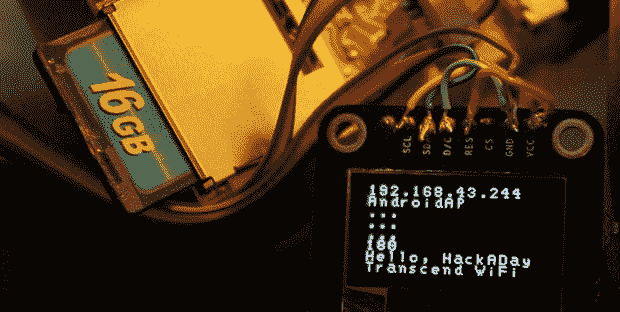

# 使用 Trancend WiFi SD 卡

> 原文：<https://hackaday.com/2013/10/17/making-use-of-the-trancend-wifi-sd-card/>

[CNLohr]大部分时间都花在互联网上，但有时现实生活会让他远离键盘。这些他称之为“假期”的地方没有良好的互联网连接，迫使他依赖于时好时坏的手机连接。考虑到这将是一些硬件黑客的绝佳机会，[CNLohr] [想出了一个“互联网 o-mometer”](http://www.youtube.com/watch?v=HT4W3CPlnAU)——一个由 Trancend WiFi SD 卡供电的设备，它使用 8×8 LED 显示屏来显示他的手机互联网连接的当前状态。

这个构建使用了我们之前见过的 [Trancend WiFi SD 卡主板](http://hackaday.com/2013/10/09/a-motherboard-for-a-wifi-enabled-sd-card/)。当卡启动时，它试图连接到他的手机的 WiFi 连接。连接后，LED 矩阵上会显示一个绿色笑脸。当下载了大量文件，或者更确切地说，ping 到 google.com 的时间超过 4 秒时，一张红色的皱眉脸表示互联网连接中断。

在其他关于 Trancend WiFi SD 卡的新闻中，包括[Dan Krause](感谢提示)[在内的许多人一直在为这些小巧的卡开发一个完整的替代操作系统](https://forum.openwrt.org/viewtopic.php?id=45820&p=5)。现在这个操作系统还很粗糙，但是如果有人想尝试的话，有一个预建的系统[。[CNLohr]还在开发他的 SD 卡主板的双面紧凑型版本，我们很乐意在他发送时提供他的 Tindie 商店的链接。](https://github.com/dankrause/kcard-buildroot/releases/tag/0.1)