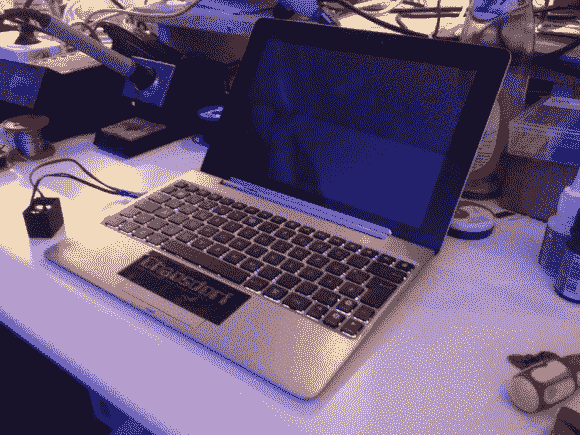

# 笔记本电脑键盘 EL 面板背光

> 原文：<https://hackaday.com/2013/10/17/laptop-keyboard-el-panel-backlight/>

[nullpointr]想要为他的华硕 Transformer Prime 配备背光键盘，以便在光线较暗的情况下更容易使用。他考虑了几种不同的选择，最终在按键后添加了电致发光面板。

那些密切关注的人可能会奇怪，为什么我们在标题中称之为笔记本电脑。嗯，这是一个带有键盘基座的平板电脑，这很拗口。这实际上有助于简化修改，因为主板和其他部分都在设备的屏幕部分。EL 面板也是一个不错的选择，因为你可以将它们切割成合适的尺寸，它们仍然可以工作。通过一点点的工作，三块面板被做得并排在一起。

驱动电池板的逆变器是原始外壳中没有的部分。它是左边的黑盒子。[nullpointr]在外壳侧面增加了一个 USB 形状的插孔，使逆变器可以非常容易地断开连接。这样，变形金刚 Prime 仍然可以和他一起上路，它只是不会亮，除非他也带着那个附件。

很久以前，我们看到有人用[光纤和 LED](http://hackaday.com/2007/02/24/diy-fiber-backlit-keyboard/) 实现了这一点。不幸的是，项目链接似乎死了，所以我们认为是时候有人重新审视这个概念了。