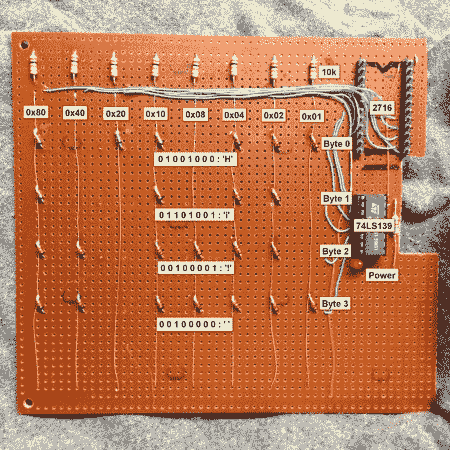

# 制作二极管矩阵只读存储器

> 原文：<https://hackaday.com/2013/10/18/making-a-diode-matrix-rom/>

这是一个很好的项目，允许青少年(但也包括成年人！)来实际查看存储在只读存储器(ROM)中的数据。上图所示的内存是由二极管制成的[。[Scott]将它作为他 2013 年](http://geodesicsphere.blogspot.ch/2013/10/visualizing-roms-1-diode-matrix-rom.html) [Barcamp 秋季](http://barcamproc.org/)关于可视化 rom 演示的一部分。他在文章的开头陈述了一个显而易见的事实:这种记忆是不实际的。尽管如此，这仍然是一个有趣的练习。[Scott]然后详细描述了你能找到的所有不同种类的只读存储器，并用几句话解释了它们是如何工作的。在他的二极管只读存储器中，通过在给定的数据线(阳极)和地址线(阴极)之间添加(或不添加)二极管来“编程”位。当拉低给定的地址线时，只有当二极管存在时，相应的数据线才会被拉低。[Scott]最后用一个只能在 DOS 下运行的非常旧的设备编程器检查了他的电路。