# 欧洲的黑客空间:杜塞尔多夫的混乱

> 原文：<https://hackaday.com/2013/10/20/hackerspacing-in-europe-the-chaosdorf-in-dusseldorf/>

今天我们有机会参观了我们的第一个德国黑客空间——位于杜塞尔多夫的 [Chaosdorf](http://chaosdorf.de/) 。他们是一个更大的组织 [混沌电脑俱乐部的成员，这是欧洲最大的黑客协会。大多专注于所有基于计算机的东西，他们喜欢摆弄树莓派和他们自己的 Makerbot Replicator II。](http://www.ccc.de/en/)

在商展上逛了一整天后，我们来到了超市的门口，按下了绿色的小门铃

一个友好的名叫[Robert]的人欢迎我们进入 180 平方米的大型黑客空间/计算机实验室。他把我们介绍给其他一些成员，并开始带我们参观。多么凉爽的空间啊！

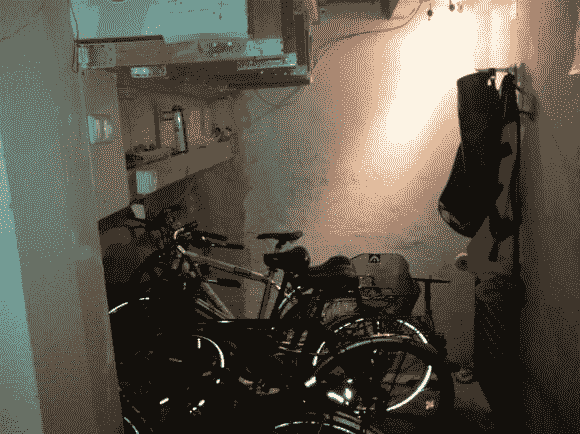

里面有一个小房间，专门为会员和客人存放和修理自行车。继续前行，我们进入主休息区，那里有舒适的沙发，一个通向主要街道的大窗户，以及一个用于电影之夜和演示的投影仪屏幕。

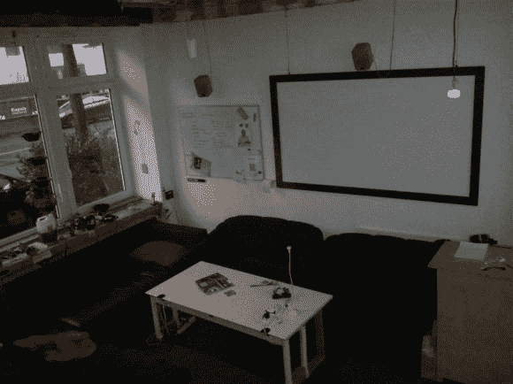

楼上甚至有一小块地方可以睡觉！

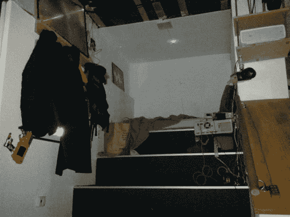

再往里是主电脑区，那里有一个漂亮凌乱的电子产品、显示器和备件的工作台！

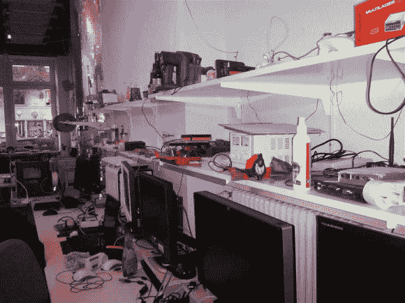

他们最近购买了一台 Makerbot Replicator II，它位于该建筑最初作为夜总会时的一根带挡板的柱子前面(稍后会有更多介绍……)

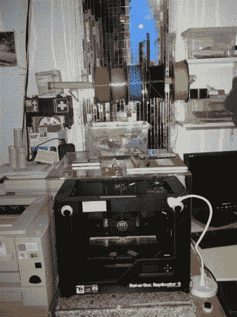

打印机是由这台电脑运行的，方便地安装在一台旧 NES 里！

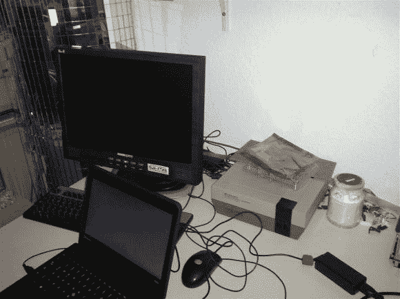

在空间的深处是电子车间——它也是他们自己酿造的啤酒的装瓶室——我们可以确认，这真的很好！

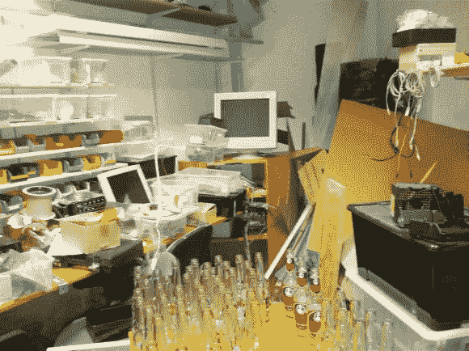

他们回收并清洗所有的瓶子——他们的最爱？赫尔曼·布鲁斯柠檬水。

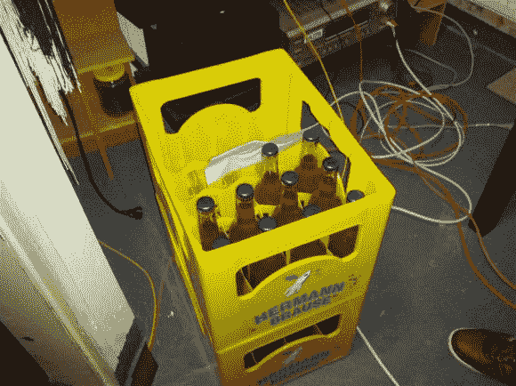

有时他们甚至为它做标签！Chaosdorf 在 CCC 中以其啤酒酿造能力而闻名——他们几乎总是带一些啤酒去大型会议上销售。

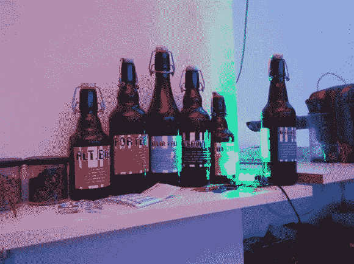

他们也有一个设备齐全的厨房，和其他当地餐馆的折扣交易——所以如果你饿了，总有东西可以吃。

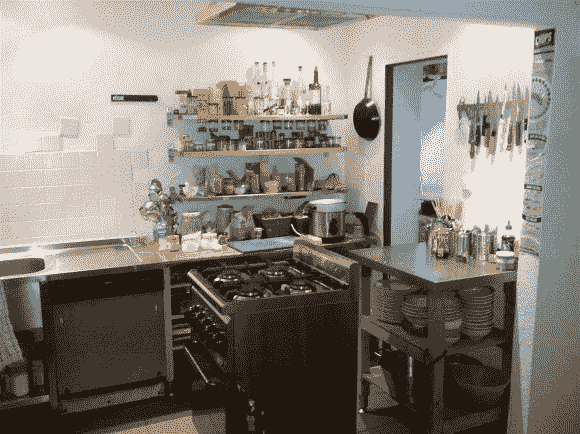

在这栋建筑作为俱乐部时的旧冷藏室里，是他们的服务器机房。在德国，电费相当昂贵，因此他们致力于尽可能减少碳足迹。几乎所有的灯都是发光二极管，所有的东西都通过几个树莓连接到家庭自动化系统上！

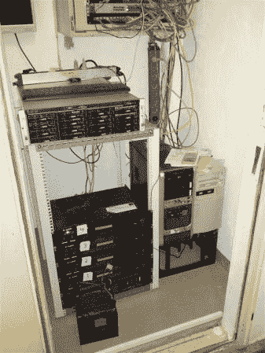

这里有一个有趣的智力测试，他们喜欢给新成员。这是一个 10 磅重的大锤，末端伸出一个 USB 插头。

通常有三种典型的结果:

1.  他们冒着损坏 USB 端口的风险，将大锤放在桌子上，以便插入笔记本电脑。
2.  他们把大锤放在地板上，摇摇欲坠地拿着笔记本。或者聪明的人…
3.  去壁橱里拿根 USB 延长线。

但之后什么也没发生。所以人们试着修理 USB 设备，检查驱动程序等等……直到他们意识到，它实际上只是一个 USB 插头——没有任何附件。

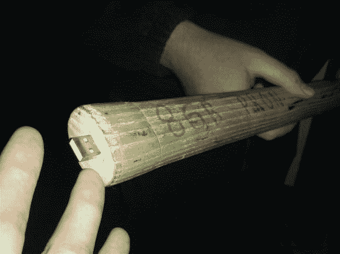

他们也有每周一次的谈话和演讲——这一次是关于牙科的……或者别的什么……是德语的，所以我们不太确定。

最后，这里有一个他们在一个指定吸烟的密室里开的玩笑——电气地球。

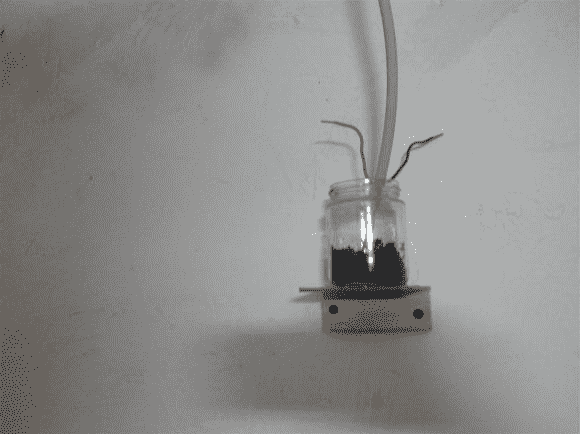

总的来说，这是一个非常酷的地方，是一个首先要参观的伟大的黑客空间！但是为了让它有今天的地位，我们做了大量的工作…

这座建筑已经有将近 100 年的历史了，它以前的功能是一个相当简陋的夜总会。事实上——它因为暴力而关闭了。这个地方空了将近 10 年，后来主人决定再次尝试出租。Chaosdorf 发现了它，并花了将近一年的时间进行翻新——看看他们网站上的图片就知道了。

下一站，车库实验室——也在杜塞尔多夫！