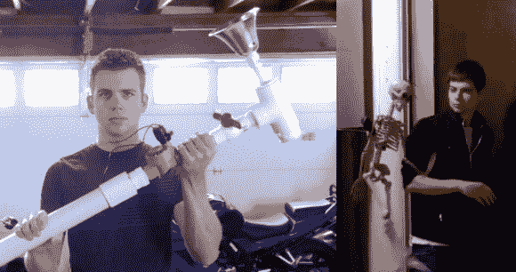

# DIY 气动骨架和气动喇叭插科打诨吓唬那些捣蛋鬼

> 原文：<https://hackaday.com/2013/10/19/diy-pneumatic-skeleton-and-air-horn-gag-to-scare-those-trick-or-treaters/>

[里克·奥斯古德]一直在忙着为万圣节制作更多吓人的笑话。本周，他分享了一个关于[气动喇叭](http://www.richardosgood.com/blog/2013/10/08/pvc-air-horn-to-scare-your-friends/)和[气动跳跃骨架](http://www.richardosgood.com/blog/2013/10/15/easy-pneumatic-piston-from-a-bicycle-pump/)的伟大想法，两者都由 24 V 喷水阀驱动。这两个新的插科打诨可以很容易地激活使用[里克的] [纸板地板开关](http://hackaday.com/2013/10/02/diy-pressure-plate-switch-for-your-haunted-house/)和三个 9 伏电池巧妙地串联在一起，为 27 伏电源(我们忍不住下降到这个链接[2196 伏电源从 9 伏电池](http://hackaday.com/2012/12/18/244-9-volt-batteries-in-series-arcing-ensues/)只是为了好玩)。

空气喇叭的结构非常独特，它使用一个橡胶气球作为簧片阀，当空气冲出时会产生很大的喇叭声。[Rick]然后将他的手动自行车打气筒连接到一个气源上，这样当一个气阀被启动时，自行车打气筒的把手就会弹出来，上面连接着一个骨架。然后它通过空气管道上的排气孔下降。空气喇叭和气动弹出骨架似乎都很容易构建，他的测试显示它们功能完美。

由于空气储存室很小，重新触发装置似乎太重复，对于连续的不给糖就捣蛋的游戏来说不实用。也许人们可以藏起一个空气压缩机，用一根长长的输送管来供应堵嘴的东西？此外，使用空气压缩机对其他可怕的空气爆炸会很方便。当然，你会希望降低压缩机的输出调节器到安全水平，这样你就不会冒险吹除你的弹出式骨架钻机或任何管道。

休息后继续看看如何制作这两个伟大的笑话，并从安全先生那里得到一些提示。

[https://www.youtube.com/embed/FgFS6y-YrhE?version=3&rel=1&showsearch=0&showinfo=1&iv_load_policy=1&fs=1&hl=en-US&autohide=2&wmode=transparent](https://www.youtube.com/embed/FgFS6y-YrhE?version=3&rel=1&showsearch=0&showinfo=1&iv_load_policy=1&fs=1&hl=en-US&autohide=2&wmode=transparent)

[https://www.youtube.com/embed/rTiT9ech7jU?version=3&rel=1&showsearch=0&showinfo=1&iv_load_policy=1&fs=1&hl=en-US&autohide=2&wmode=transparent](https://www.youtube.com/embed/rTiT9ech7jU?version=3&rel=1&showsearch=0&showinfo=1&iv_load_policy=1&fs=1&hl=en-US&autohide=2&wmode=transparent)

安全建议:保持聚氯乙烯管道中的压力非常低，因为管道可能会意外破裂，尤其是在寒冷的天气或管道老化或暴露在阳光下。我们见过其他人用一卷或两卷胶带包裹聚氯乙烯气室，以防气室失效。在任何胶合管道干燥至少 24 小时之前，不要对其施加压力，如果在完全干燥之前施加压力，部件将会剧烈分离。最后，当使用加压室时，你真的必须知道你计划置于压力下的材料的安全极限。最好使用标有压力等级的商业制造和焊接的储气罐。即使由金属螺纹管构成，金属腔室的额定压力也要高得多。别忘了，至少在美国，你可以在港口货运公司买到便宜的空气调节器和 125 磅/平方英寸 11 加仑的便携式气罐，用来装吓人的东西。