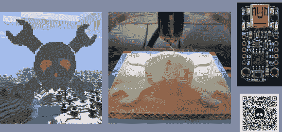

# 在某物上打上 Hackaday 标志并赢得一个小饰品

> 原文：<https://hackaday.com/2013/10/21/pander-to-us-and-win-a-trinket/>

众所周知，我们喜欢看迎合黑客的项目演示。这经常以我们的页面加载到屏幕上的形式出现在 build photos 中，或者创造性地使用我们的骷髅头和扳手标志。现在是你迎合一点战利品的机会了。[菲利普·托伦]提供了 20 块 [Adafruit 的新 5v 小饰品板](http://hackaday.com/2013/09/05/a-really-really-tiny-microcontroller-board/)作为赠品，我们不能拒绝从读者手中得到免费的东西。

所以这是个交易:在某些东西上使用 Hackaday 标志。这可以是任何事情。上面的图片显示了 Hackaday 员工制作的三个例子。有一个在《我的世界》生存服务器上一块砖一块砖建造的标志，一个打印成徽章的 3D 版本，以及一个在二维码内有点压扁的版本。我们将(似乎是任意地)从所有提交的作品中选出 20 名获奖者，但这里有一些指导方针可以帮助你脱颖而出:

*   将优先考虑最大的(你能把我们放在建筑物的一侧吗？)和最小的([电子显微镜有人吗](http://hackaday.com/2009/12/25/hackaday-links-christmas-2009/)？)投稿。
*   为了使缩放更容易，这里有一个黑客日标志的矢量图形
*   解释你做了什么以及你是如何完成的条目更有可能被选为获奖者

感谢所有提交作品的人，比赛结束了！将您的提交详细信息发送到我们的提示行(不要忘记在标题中提到类似于[饰品大赛]的内容！)。为了获得奖品，您必须填写您的姓名、地址和电子邮件地址(这些信息仅被 Adafruit 用于发送硬件并在硬件发货时通知您)。请在 11 月 1 日星期五之前报名，以便获得参赛资格。显然，Hackaday、SupplyFrame 和 Adafruit 的员工及其家人没有资格获奖。