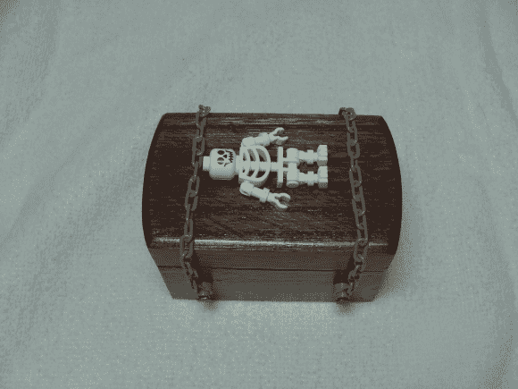

# 万圣节敲门盒

> 原文：<https://hackaday.com/2013/10/20/halloween-knock-box/>

[Kyle]一直是 HaD 的忠实读者。事实上，他的灵感来自 4 年前的一个万圣节敲钟盒！他保留了这个链接，最终在今年，他开始制作自己的链接。

那到底是什么？嗯，顾名思义，你敲它，它就敲回来。如果你敲它特定的次数，它会奏出秘密的曲调…这是任何万圣节活动中的一个很棒的小物品——孩子们喜欢它！

这个盒子的设计和功能与最初的基本相同，只有一些修改——最明显的是，用 ATtiny85 微控制器取代了最初的 PICAXE。[凯尔]甚至设法在易贝找到了乐高骨架和链条。他在博客上发表了一篇非常全面的文章，并分享了所有的代码和图表——所以如果你正在寻找一个最后一分钟的万圣节项目，这可能就是它了！

休息后留下来看看敲门的效果！

[https://www.youtube.com/embed/CwI32rDunJQ?version=3&rel=1&showsearch=0&showinfo=1&iv_load_policy=1&fs=1&hl=en-US&autohide=2&wmode=transparent](https://www.youtube.com/embed/CwI32rDunJQ?version=3&rel=1&showsearch=0&showinfo=1&iv_load_policy=1&fs=1&hl=en-US&autohide=2&wmode=transparent)

万圣节快到了！别忘了把你的万圣节技巧发到举报热线！