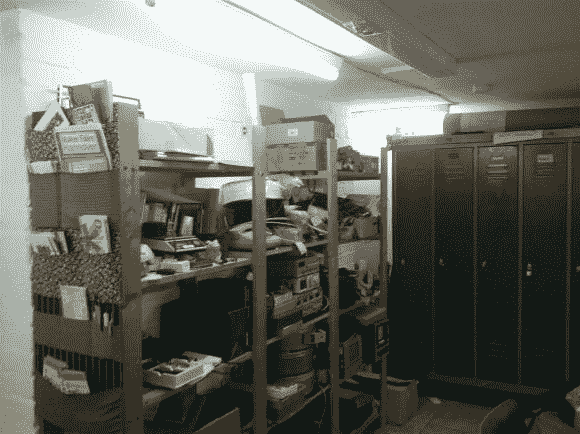

# 欧洲的黑客空间:杜塞尔多夫的车库实验室

> 原文：<https://hackaday.com/2013/10/20/hackerspacing-in-europe-the-garage-lab-in-dusseldorf/>

车库实验室 ( [翻译](http://translate.google.com/translate?hl=en&sl=auto&tl=en&u=http%3A%2F%2Fgarage-lab.de%2F))是一个离混沌公园很近的小型黑客空间。顾名思义，它存在于一个车库综合体中——每个单元都有一个车库和一个楼上的办公室。车库实验室与楼上的一个共同工作空间共享他们的单元——基本上，他们一直都有车库，但只有在周末楼上空着的时候才有。

它已经存在了大约 2 年，有大约 40 个成员(其中大约 20 个是活跃的)。成为会员很便宜，如果你是学生，只需€15 英镑/月或€10 英镑/月。他们主要关注 3D 打印和电子产品。

该空间有几台 3D 打印机、一个大工作区和许多手动工具。他们经常开设 CAD 课程，并希望扩大 3D 打印课程和其他技术讲座。我们的向导是一个叫[Axel]的很酷的家伙，他在自己的公司做 3D 设计师，但喜欢向全世界传播 3D 打印知识。

去参观画廊吧！

这是实验室的入口——没有真正的标志，但当我们看起来相当迷路时，一个友好的德国人给我们指了路。

紧接着里面是主要的车库区域，里面是工作台和手工工具，大部分是由会员捐赠的。

隔壁房间堆满了架子和装满项目的储物柜。

它不是一个很大的空间，但对于成员的数量来说，它非常适合他们。

常驻 RepRap 打印机！

最近的一个 3D 打印项目——自制 Oculus Rift 护目镜！

总而言之，这是一个非常酷的地方，有一些非常友好的黑客——如果我们住在杜塞尔多夫，那绝对是一个称之为家的地方！他们希望扩张，但在获得资金和适当的宣传方面有些困难——所以如果你有任何建议，请在评论中留下吧！

接下来，荷兰赫尔兰的阿克塞普！