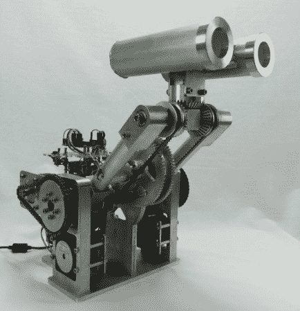

# 沃尔特是一个从头开始建造的机器人头部。

> 原文：<https://hackaday.com/2013/10/21/walter-is-a-robot-head-built-from-scratch/>

[克里斯]组装了一个机器人头部，乍一看令人印象深刻。当你意识到[克里斯]从零开始建造每一个部件时，机器人沃尔特 II 会变得更加令人印象深刻。沃尔特的许多零件都是用克里斯自己制造的机器制造出来的。沃尔特是个机器人。他的上颈部关节是基于三个锥齿轮。两个步进器驱动侧齿轮。当步进器被驱动到相同的方向时，沃尔特点点头。当它们被向相反的方向驱动时，头部会转动。最终结果允许沃尔特的头部被平移和倾斜到几乎任何位置。

第二对马达通过链传动提升和降低沃尔特的脖子。当沃尔特的下颈部关节被驱动时，一个由齿轮和皮带组成的系统保持着他头部的倾斜，这一点还不能马上看出来。例如，如果沃尔特的头直接向前，脖子抬高，人们会认为他的脖子放低时是面向地面的。齿轮/皮带系统确保当颈部关节达到其下限时，Walter 仍将面向前方。所有这些都是在颈部电机没有任何运动的情况下发生的。[Chris]肯定在这个系统的机械设计上花了很多心思。

机械装置有助于保持电气系统的简单。两个 Arduino Nanos 运行 [Reprap 茶杯固件](http://reprap.org/wiki/Teacup_Firmware)。这意味着沃尔特的母语实际上是 g 代码。一个 Arduino 控制锥齿轮接头(g 代码中的 X 和 Y)。第三个 Arduino 控制颈部上升/下降(g 代码中的 Z)。一系列步进驱动器完善了这个系统。我们认为头部和颈部在履带驱动系统上看起来会很棒。[五号还活着](http://www.youtube.com/watch?v=4TBcQ8h_kXU)！

[https://www.youtube.com/embed/-n_jZG4fD_w?version=3&rel=1&showsearch=0&showinfo=1&iv_load_policy=1&fs=1&hl=en-US&autohide=2&wmode=transparent](https://www.youtube.com/embed/-n_jZG4fD_w?version=3&rel=1&showsearch=0&showinfo=1&iv_load_policy=1&fs=1&hl=en-US&autohide=2&wmode=transparent)

[谢谢乔恩]