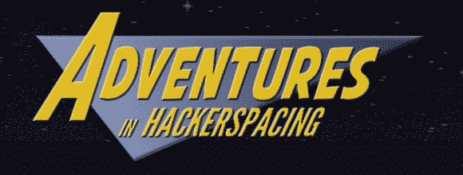
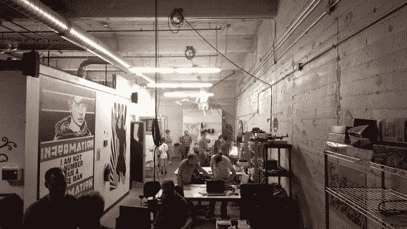
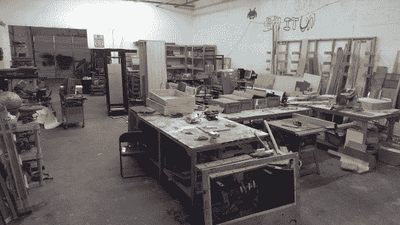
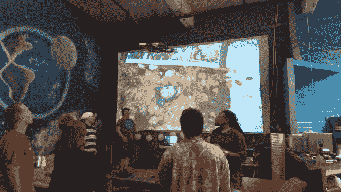

# 黑客空间历险记:亚特兰大自由城，第二部分

> 原文：<https://hackaday.com/2013/10/21/adventures-in-hackerspacing-freeside-atlanta-part-ii/>

本周*黑客空间历险记*、*、* Freeside Atlanta 第二部分:入侵黑客空间！

在了解了空间背后的文化之后，我迫不及待地向黑客空间的资深人士艾伦(Alan)和史蒂文(Steven)询问细节、幕后的关键决策，尤其是一个问题:对一个黑客空间来说，最重要的要求是什么？[艾伦]插话回应道:

> 第一名显然是个心甘情愿的房东。我认为，如果你有一个愿意房东，其他一切都是偶然的。如果你在第二层，你会让自己很难，但如果你有一个愿意的房东，就走第二层。

这不是我期待的答案，但当你环顾 Freeside，它开始变得有意义…

涂鸦、街头艺术或某种壁画几乎覆盖了每一面墙，包括一个隐藏在浴室门后令人恐惧的瘦长人。我预计“设施的规模”会在他们的列表中排名更高——近 6000 平方英尺的 Freeside 有大量的腿部空间——但即使是车库或小办公室也可以作为少数从事软件或小型电子工作的人的黑客空间。

相反，[Alan]和[Steven]投票给一个你可以修改和改进的地方。Freeside 位于大都市商业和艺术区(T1)的仓库中，该区有着为创造性利用空间的人提供住所的历史。根据[Alan]的说法，与同一仓库社区的其他人相比，Freeside 是一个保守的物业使用者。它也在一楼，因为拖着沉重的设备上楼比它的价值更麻烦。也有例外。正如[艾伦]所指出的，MASScollective 是一个带货梯的三层空间，因此一层以外的空间不一定是交易的破坏者。你只需要[发挥创意，把设备搬到一楼以上](http://hackaday.com/2012/06/19/hoisting-a-laser-cutter-to-the-3rd-floor-and-other-fun-youll-probably-never-have/)。

[Alan]和[Steven]还花时间详细介绍了黑客空间及其管理员可能面临的一些法律问题。但是首先，典型的免责声明:

**我不是律师，以下信息不是法律意见。[艾伦]和[史蒂文]也不是律师，所以在对你的黑客空间做出任何法律决定之前，一定要咨询真正的律师。**

Freeside 正式成为佐治亚州的一家非营利公司，他们已经申请了 T2 联邦 501(c)(3)(T3)身份，这将带来一些税收减免。作为一个联邦非营利组织申请是一项艰巨的任务。[Alan]解释说，堆积如山的文书工作(约 80 页)和不断增加的保持一致和准确记录的责任会阻碍申请空间。对于 Freeside 来说，这种努力是值得的。联邦非营利组织的地位看起来对拨款申请很有利，而且[Steven]承认他们已经被拒绝了几个微补助金，因为 Freeside 仍然在等待 501(c)(3)的回音；他们的申请被搁置了。

为你的空间选择正确的[组织类型](https://en.wikipedia.org/wiki/501(c)_organization#Types)也很重要。Freeside 选择了 501(c)(3)——一个教育和/或科学组织——因为他们努力教育社区，并且他们的成员[在医学领域发表了学术文章](http://blog.freesideatlanta.org/2012/04/draft-freesiders-hackers-collaborate-in.html)。一些空间走 501(c)(7)的路线——社交和娱乐——因为他们只能声称是一个车间组织。

他们还指出了注册为有限责任公司的好处；如果该组织产生了债务，它的创始人对该债务不承担责任。他们可以解散公司:假设该组织在其他方面表现负责。正如[Steven]所说，疏忽胜过大多数法律安全网，所以最好在文书工作和实践中光明正大。

然后还有另一种责任问题:安全。

Freeside 有一个地狱般的工作间，[Alan]很高兴带我参观，但在我戴上他递给我的护目镜之前。没有人指望会员们走进来时会有如何操作每一个电动工具的百科知识。然而，无论是谁教你使用这种又大又吵的设备，都有可能被受训者误用。如果[艾伦]教你如何操作台锯，而你受伤了，那是谁的错？这是一个让自由党成员紧张不安的问题。[Alan]解释了他们是如何通过仔细选择教学语言来解决问题的，然后通过法律途径解决问题:

> 我们没有说“我们认证”你使用任何东西。我们认识一个焊工，他实际上能够认证人们进行焊接，但是如果我们在切割 2×4 的空间进行扩建，我会假设他们会使用锯子。如果他们使用台锯并弄伤了自己，事情就变得棘手了。他们是自愿的，所以他们不能让 Freeside 负责，但这不包括我个人。所以我买了一把伞来保护我免受这类事情的伤害。

个人保护伞保险比 T2 董事和官员保险便宜，艾伦只在你打算雇佣员工时才推荐这种保险(它涵盖了平等机会等。)现在，只要 Freeside 的人不制造疏忽的环境，指导就不再是问题。你可以查看 [Freeside 的政策页面](https://wiki.freesideatlanta.org/fs/Policies)了解更多信息和其他指导方针。这些政策中的许多应该被看作是“操作手册”而不是严格的规则手册。像 Freeside 的大多数东西一样，他们的政策是由流动性授权的。

Freeside 有更多的故事要讲，但我将在这里结束这次冒险，而是建议你自己[去看看他们的空间](https://wiki.freesideatlanta.org/fs/Info)。周二晚上来参加他们的开放日，在那里你肯定会遇到很多友好、博学的人，并且可以在大屏幕上的 YouTube 视频中享受[艾伦]的怪异品味。

非常感谢[Alan Fay]和[Steven Sutton]忍受了我三个多小时的提问和至少同样多小时的潜伏，非常感谢我的老朋友[Brian Cribbs]把我介绍到 Freeside 社区。

最后，我想听听你的冒险经历。[给我写封短信](mailto:tips@hackaday.com?Subject=[Adventures in Hackerspacing])，告诉我你的空间的政治，疯狂的事故，你如何监管安全，法律威胁，那个坐在你的空间外的车里打电话问他是否可以用它来为儿童上演木偶剧的令人毛骨悚然的家伙(你必须问[Steven]那个)，或者你想在下一部《黑客空间的 T2 历险记》中看到的任何东西。