# 欧洲黑客空间:海尔伦的 ACKspace

> 原文：<https://hackaday.com/2013/10/23/hackerspacing-in-europe-ackspace-in-heerlen/>

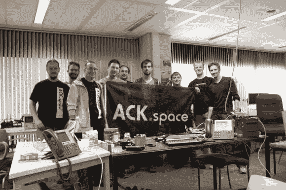

欢迎来到海尔伦的 [ACKspace](https://ackspace.nl/wiki/Main_Page) 。到目前为止，这是我们参观过的最酷的黑客空间之一——超级好客！让这个空间真正整洁的是位置。它位于一栋几乎空无一人的办公楼的一楼。他们在一楼有三个官方房间。Hackspace、Slackspace 和 stack space——不言自明。

我们在火车站受到了[帕特里克]的欢迎，他非常方便地主动提出来接我们，并直接带我们去阿克塞尔区！谢谢[帕特里克]！

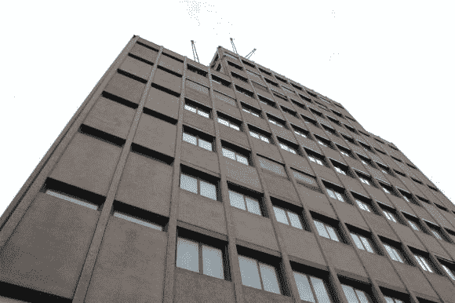

这是 ACKspace 居住的 10 层办公楼。他们占据了一楼的大部分，并(在某种程度上)自由支配其余部分。

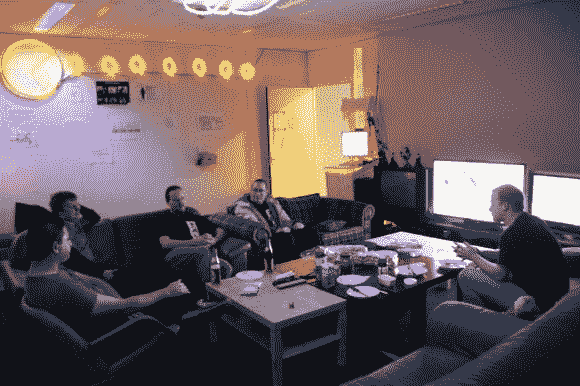

这是休闲空间，会员可以在这里放松、看电影和玩游戏。可能有点太舒服了！

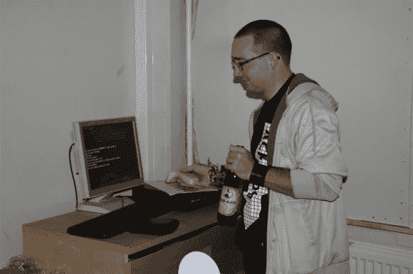

他们还有一个利用条形码扫描仪的食品和饮料结算系统。似乎是黑客空间的共同主题，是任何空间的第一个也是最重要的项目。软件是 Bash 写的，因为，何乐而不为！

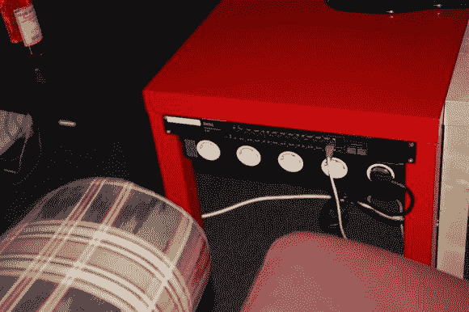

认得这些桌子吗？它们是便宜的[“LACK”宜家的](http://makezine.com/2010/01/22/lackrack-ikea-server-racks-for-livi/)，刚好是服务器的完美宽度。

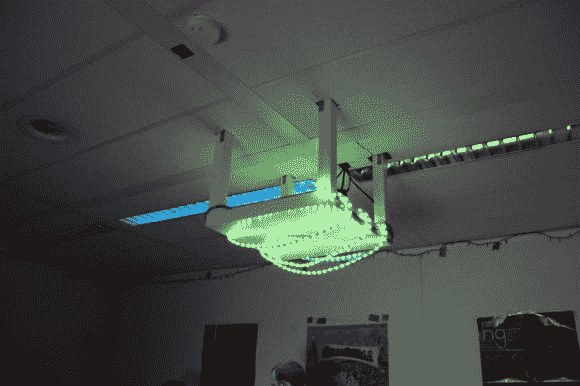

…它们还可以从天花板上支撑投影仪！

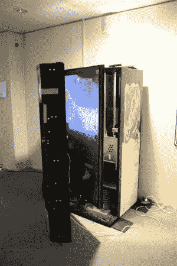

他们也有一台旧的可乐机，他们计划对其进行改造——这仍然是一项正在进行的工作，但他们喜欢将他们的项目称为过程，因为项目意味着结束日期。

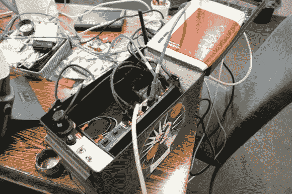

其中一个成员正在开发一个非常酷的便携式电话盒——我们很快会报道它！

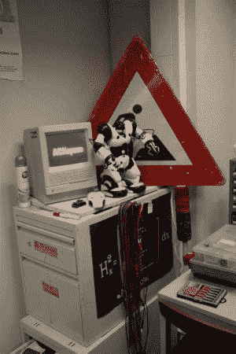

虽然这看起来像一台旧的麦金塔，但实际上就是这样。

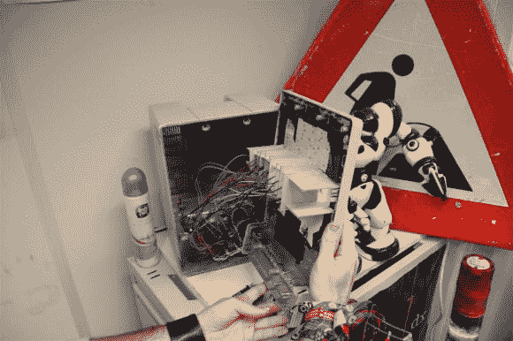

内部是一个 RGB LEDs 阵列。看起来棒极了！

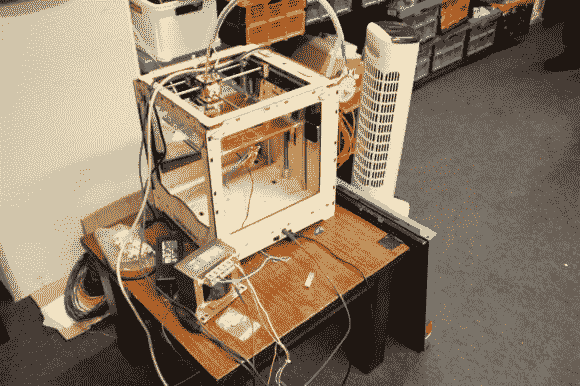

他们的一台 3D 打印机，一个工具制造商

一个伟大的关键组织者使用以太网插孔。潜在的黑客可以检测到这些密钥！

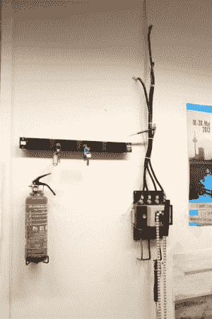

右边的大开关是改变空间状态的主“电源”开关——会员和客人都可以查看网站，看看是否有人在家。

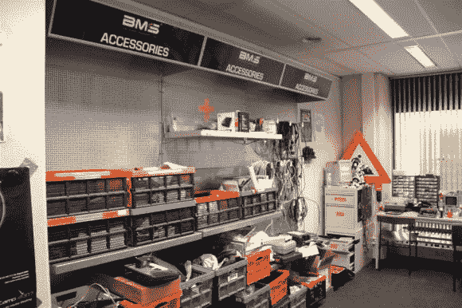

他们也有一面很好的组件墙，此外还有堆放空间，因为有点乱，所以没有显示出来。

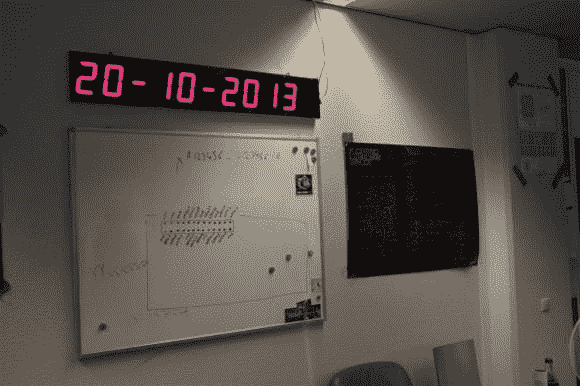

LED 挂钟每 20 秒改变一次显示。首先是日期，然后是时间…

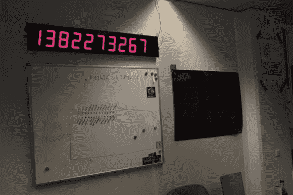

…然后又是 Unix 时间。

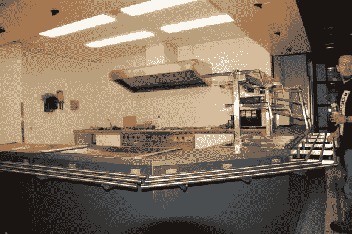

离开了储藏室，我们开始参观大楼的其他部分。一楼还有一个很大的空自助餐厅，楼里的任何人都可以使用。

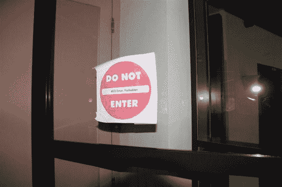

还是没有？

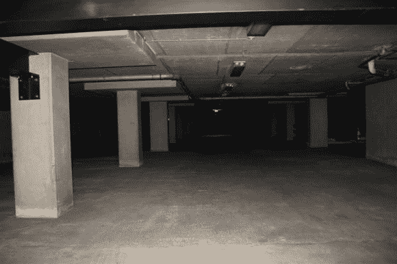

这可能是 ACKspace 最酷的特性之一。地下两层空停车场。有人会说激光枪战吗？

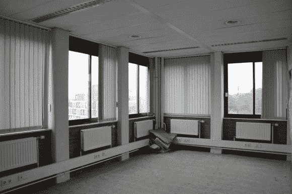

这是上面楼层中众多空置空间中的一个例子。只有大约 20-25%的建筑被占用。租金非常便宜(3 个大房间每月约 250 欧元)，但如果你打算住在其中一个空间，你需要带一个便携式淋浴。

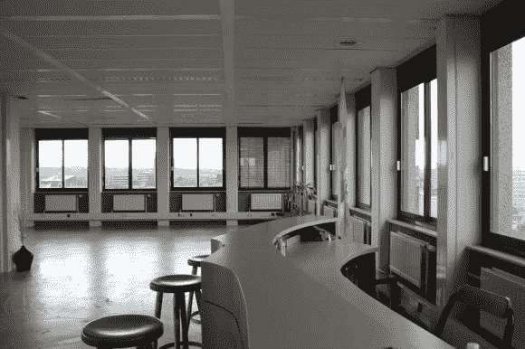

他们原本想要 10 楼，但房东不想要顶层的实验室，所以那里有一个舞蹈室。他们还必须为它铺设新的以太网线路，因为它从来没有被连接过。我们有没有提到阿克塞尔负责大楼的信息技术？他们还维护着并不存在的神奇的服务器机房。

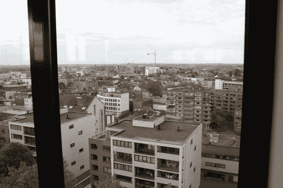

从顶部看风景很棒！据说从屋顶可以看到德国和比利时——非常适合新年，可以从各个方向观看烟火。

他们隔壁的大楼就没那么幸运了——已经被擅自占地者接管了。必须热爱荷兰法律！

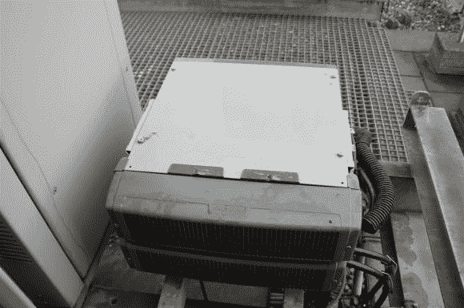

在屋顶上，您可以找到几个服务器机箱…

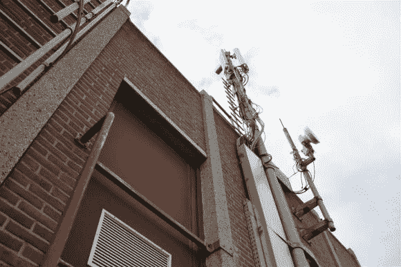

和天线。

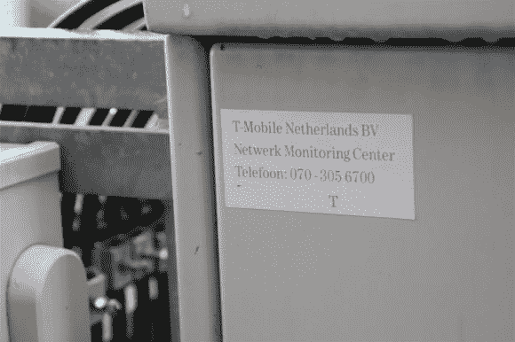

原来是 T-Mobile 站！

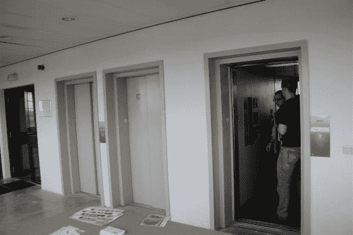

即使大楼大部分是空的，有时也很难使用电梯。只有一个还能用，因为每年重新认证要花很多钱——所以大楼的所有者只做一个。
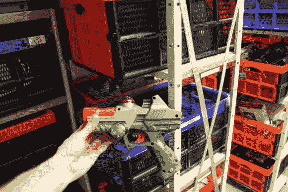

激光标记手枪。

这里有一个有趣的愚蠢的黑客，垃圾箱上的弹簧铰链坏了——所以他们增加了一个配重！

像往常一样是俱乐部队友。如果你还没有注意到的话，每个黑客空间都喝俱乐部队友。唯一的问题是，它只在德国出售，所以几乎所有的黑客空间也进行俱乐部队友运行，并在德国购买许多情况下带回家。

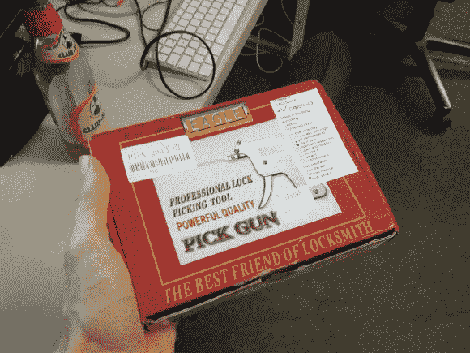

一些成员喜欢撬锁，但我们喜欢的是标签——它告诉你这是谁的，谁可以使用它，以及其他重要的事情。大多数黑客空间都使用这个系统，它非常有效地让事情井井有条。

我们真的很享受在 ACKspace 的时光，希望能尽快回来！如果你住在欧洲的任何地方，它绝对值得一游！