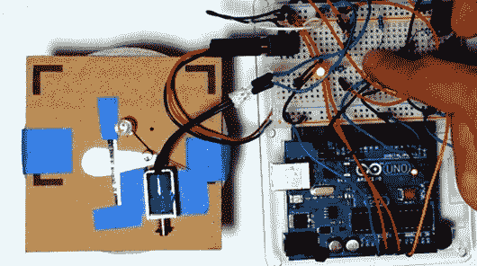

# Arduino 控制的单页快门

> 原文：<https://hackaday.com/2013/10/23/arduino-controlled-single-leaf-shutter/>

[Kevin]用 Arduino 和螺线管制作了一个有趣的相机快门。简单来说，他只控制一片叶子。在链接的视频中，你可以看到他把它从 1/125 秒提高到无限。当然，这只是一个概念验证，Kevin 提到使用更小的组件来使所有的东西都容易放入一个类似 Holga 的身体中。正如他在视频的评论中指出的，数字控制闪光灯也是一件简单的事情。

一台基本的相机制作起来非常简单，而且[凯文的]设计当然也不复杂。也就是说，如果你从大的方面来看，[Kevin]正在展示用一个标准的微控制器作为大脑来建造一个完全定制的相机是多么的可行。当你能够控制整个拍照过程时，我们不禁会想到所有的可能性。

有趣的是，[凯文]也是今年早些时候这个双镜头反光 Kickstarter 项目的幕后推手。看看我们还会从他那里看到哪些与相机相关的黑客将会很有趣。