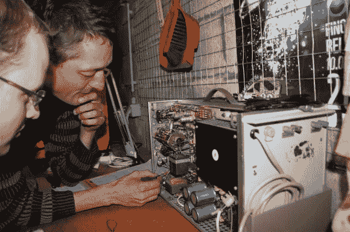
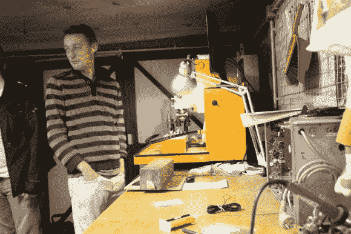
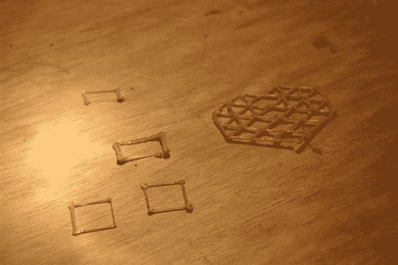
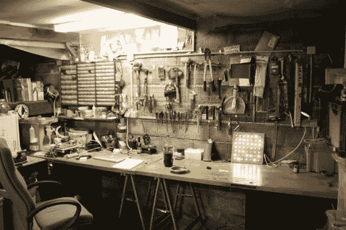
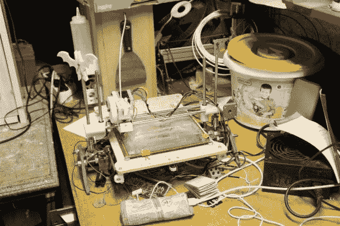
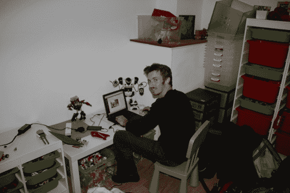

# 欧洲的黑客空间:安特卫普的露天车库

> 原文：<https://hackaday.com/2013/10/22/hackerspacing-in-europe-garage-space-in-antwerp/>

欢迎来到欧洲最小的(？)hackerspace 的所有者安东尼·利肯斯(Anthony Liekens)可能是最大的心脏！这是[露天车库！](http://www.meetup.com/OpenGarage/)

你可能还记得最近一篇关于野生木材的帖子。这是由【安东尼】和他的密友【迪帕克】完成的。在我们分享了他的项目后，他通过电子邮件联系了我们，打开了一个参观露天车库的邀请——事实证明，我们将在比利时安特卫普非常接近它！参观完无效保修后，[Anthony]邀请我们去喝啤酒，参观他独特的黑客空间…

那么，是什么让这里成为欧洲最独特、或许也是最小的黑客空间呢？

嗯，这只是[安东尼的]车库开始。他热爱黑客空间，是无效担保的积极成员，但也喜欢自己的工具，他有很多这样的工具。所以他决定每周一次在周四晚上向社区开放他的私人车库。不用交会员费，欢迎大家。它已经运行了将近 2 年，在这段时间里，只有一个星期四是安东尼一个人的！他的妻子在房子的地下室组织手工艺小组——所以他们每个人都有自己的小团体。

他确实有一个捐赠罐，但对这个空间做出贡献的主要方法是喝酒。人们需要自带啤酒(这是比利时生活的一部分)，而且碰巧瓶子上有押金。Open Garage 的成员留下他们的空瓶子，瓶子付钱给[Anthony]来补充包含基本电子部件的组件抽屉。

他有一台非常好的数控铣床，是由当地一所学校捐赠的——就是在 3Doodler post 上看到的那台。他们不得不重新布线并安装新的驱动程序来使它工作，但该小组完全能够应对这一挑战。

这里有一些连接到数控机床的 3Doodler 的测试打印，亲自来看看我们的特色项目真是太酷了！

这是主工作台。在最左边，你可以看到一台 3D 打印机、组件抽屉和许多沿墙摆放的工具。

这是 Printrbot 种类的常驻 3D 打印机的特写。

另一个工作台的视图——还有一台数控车床藏在桌子下面，还没有被~~黑过~~修好。

空间很小，但效果很好。平均每周大约有 10 个人出来，但是他有超过 100 个通过 MeetUp.com 注册的会员

最后，这是我。在他兼做孩子游戏室的客房写这篇文章。我认为这张照片总结了[安东尼]的慷慨和社区精神。哦，我们有没有提到他明天要开车带我们去埃因霍温看疯狂空间和荷兰设计周？

如果你曾经在安特卫普，你必须来看看开放的车库，并为此事作废担保。这里的人太棒了！哦，如果你需要一个熟练的制造者、代码猴子或生物信息学家，请访问他的网站[# Anthony needs a job](http://anthonyneedsajob.com/)——他即将加入一个令人兴奋的初创企业，但同时也想做一些短期的合同工作！我们百分百推荐这个人。

谢谢[安东尼]！