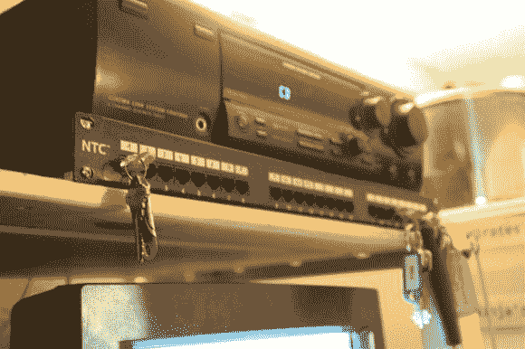

# 欧洲黑客空间:安特卫普的无效保修

> 原文：<https://hackaday.com/2013/10/25/hackerspacing-in-europe-void-warranties-in-antwerp/>

欢迎来到比利时安特卫普的[无效保修](http://www.voidwarranties.be/index.php/Main_Page)！

我认为他们网站上的这段话很好地概括了这个领域:

> 无论我们破解了什么代码，无论是编程语言、诗歌语言、艺术、数学或音乐、曲线或色彩、中子或电子，我们都创造了新事物进入我们世界的可能性。

这种说法很酷！

紧接着里面是一个配线架钥匙架——我们在 ACKspace 第一次看到它是这样做的[，这绝对是一个整理钥匙的好方法！现在，如果他们在机架上添加一些人工智能会怎么样…](http://hackaday.com/2013/10/23/hackerspacing-in-europe-ackspace-in-heerlen/)

他们还有一个很好的食品和饮料跟踪系统，这是我们见过的第一个带触摸屏的系统！但是等等，那不是 CRT 显示器吗？被黑了。快乐的小家伙是打开现金抽屉的拉绳。再说一遍，这是一个荣誉系统，但它是有效的。

当我们到达时，其中一个成员正在工作他的数码管系统——非常酷的设置！

这是主休息室、厨房和办公区。无效保修是在一个不错的安静的社区青年之家的地下室。如果我们没记错的话，这房子有 100 多年的历史了。

穿过主要区域是一个工具室，里面配备了几乎所有你想要的手动工具…

这是对主休息室的回顾——注意到左边的队友了吗？

下一个系列的房间是专门用于更多的电子黑客。这座建筑本身有一个非常好的旧地下室的感觉，虽然很好很干净！

另一边有 3D 打印机，更多的工作台，和一些保持天花板位置的结构支撑…

这些是花园侏儒。就在今年夏天，Void Warranties 参加了 [OHM2013](https://ohm2013.org/site/) 荷兰黑客营，3000 多名黑客来到一个偏僻的地方进行了近一周的黑客活动！无论如何，他们需要一些东西来装饰他们的营地——他们选择了花园侏儒。加上几个红色发光二极管，你就有了一个令人毛骨悚然的守护者，把它放在外面的黑暗中。酷的是，其他黑客空间借用了侏儒，他们中的一些人甚至攻击他们来增加运动。大多数 gnomes 都设法使保修失效——有些还有额外的令人毛骨悚然的功能！

这是他们在黑客空间后面的小服务器室…

和服务器对面的小型管理和测试平台。

他们有一大箱古代科技杂志，让人着迷地翻看！后面看到的架子是项目看到的最后一个地方——为了节省空间和不成为垃圾场，项目最终会出现在这个架子上，必须由成员认领或扔掉。他们希望把它完全腾空，这样他们就可以放一个新的工作台进去，但是你知道东西是怎么堆积起来的。

靠近主入口的是其中一个会员存储区——他们用大黑盒子把东西收拾得整整齐齐。

当我们在无效保修的时候，[[Deepak](http://3deeeeprinting.blogspot.nl/)带着他的 3Doodler 过来了，我们都试了一下——这比看起来要难多了。

最后，我们有一件很棒的艺术品被裱在楼梯上方——他们用和原始肖像一样的色调添加了太空入侵者，看起来棒极了。

总而言之，无效保修是一个非常酷的空间，有一种很好的家的感觉。如果你曾经在这个地区，一定要去看看，认识一些了不起的人！