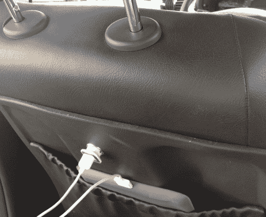

# 后座 USB 充电器

> 原文：<https://hackaday.com/2013/10/24/backseat-usb-charger/>

无论你是被安排在车后座，还是被束缚在电源上，你都可以从[添加自己的后座 USB 充电器](http://www.instructables.com/id/Backseat-USB-charger/)中受益。虽然这是一个相当简单的方法，但我们对它的干净程度和它提供的便利感到惊讶。

[wongman2001]首先抓起一把套筒扳手，把他的座位从地板上的栏杆上拧下来。然后，他拔掉了椅子加热和电动座椅调节的电源插头。将椅子从汽车上拆下后，[wongman2001]进一步解剖了它的部件，拆下了它的背板，并测试安装了一个女性香烟适配器。虽然这个座位在头枕附近有足够的空间，但你可能需要雕刻出一些泡沫，以便在你的车内舒适贴合。为了获得所需的 12V 电压，[wongman2001]接入座椅电机的电线，然后焊接并绝缘连接到点烟器插孔。

看看其他一些看起来干净的汽车黑客，如[隐藏的 MP3/USB Aux 黑客](http://hackaday.com/2013/04/04/mp3usbaux-hack-hidden-behind-cassette-facade/)或 [Nexus 7 双 DIN 仪表板黑客](http://hackaday.com/2013/01/29/adapting-the-nexus-7-for-a-double-din-car-dashboard-opening/)。