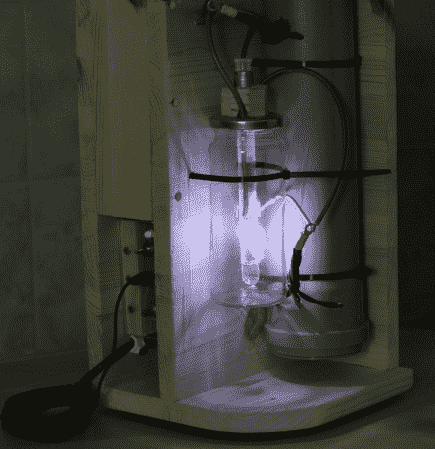

# 一个更 DYI 气隙闪光装置

> 原文：<https://hackaday.com/2013/10/24/a-much-more-dyi-air-gap-flash-unit/>

作为对我们几天前推出的另一款气隙闪光灯的回应，[Eirik]给我们发来了他最近制作的另一款[闪光灯的提示。在他的设置中，闪光峰值强度的持续时间约为 300 纳秒(1/3，333，333 秒)。提醒一下，空气闪光装置由高压电容器充电电路、按需触发放电电路、高压电容器和空气闪光管本身组成。闪光管包含两根电线，这两根电线分开的距离足以保证在最大电势下不会产生火花。将第三根电线与另外两根电线分开，放在管子里。这根电线连接到一个触发/脉冲变压器，这将电离两个电容引线之间的间隙。这导致间隙击穿并形成火花，从而产生闪光。](http://uzzors2k.4hv.org/index.php?page=airflashunit)

[Eirik]用一个橄榄罐和一个玻璃试管建造了他的闪光管。从上面的(非常好看的)图片可以看出，火花沿着玻璃试管传播，使得淬火比在露天火花中快得多。[Eirik]用胶带、锡箔和透明胶片制作了 7 个大约 2nF 的卷状电容器，建造了自己的高压电容器。为了“安全”，它们被储存在聚丙烯管中。看看网站上显示的原理图和整体电路就知道[Eirik]有多熟练，让我们认为这是一个更好的创造而不是一个黑客。

声明:和前面的[气隙闪光](http://hackaday.com/2013/10/22/making-an-airgap-flash/)一样，这里用的是高电压，所以不要在家里这样做。