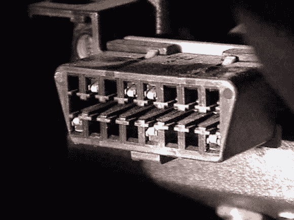
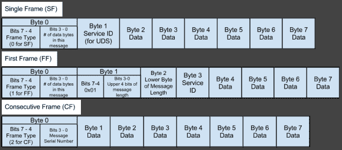

# CAN 黑客:协议

> 原文：<https://hackaday.com/2013/10/29/can-hacking-protocols/>

我们已经学习了 CAN 的基础知识，并了解了 CAN 数据库的工作原理。现在我们来看看 CAN 上常用的一些协议。

在[的上一篇文章](http://hackaday.com/2013/10/22/can-hacking-the-in-vehicle-network/)中，我们研究了 CAN 数据库，其中消息的每一位都被映射到特定的含义。例如，ID 为 0x400 的 CAN 消息的第 1 位可能表示发动机当前是否正在运行。

然而，对于更复杂的通信，我们需要使用协议。通过就发送和接收数据的结构达成一致，它们可以将许多含义映射到一个 CAN ID。

## OBD-II

The standard OBD-II connector

下次你坐在驾驶座上时，看看你的左膝周围。你会发现一个类似上面的连接器。这是 OBD-II 连接器。

OBD-II 协议不是 can 专用的，可以通过 UART 和 PWM 通道以及 CAN 实现。1991 年，当加州空气资源委员会要求在加州销售的所有车辆都要有诊断协议时，OBD-II 开始出现在汽车上。由于在较新的车辆中总是通过 CAN 完成，因此该连接器可让您访问至少一条车辆 CAN 总线。

OBD-II 用于读取车辆参数和故障代码。通过使用各种 OBD-II 模式，您可以读取包含车辆状态信息的参数 id(PID)。维基百科有一篇关于 OBD-II 模式和 PID 的文章。

有大量关于 OBD-II 的信息，你可以花不到 20 美元买一个工具来读取故障代码并清除你车上讨厌的检查引擎灯。与其详细讨论 OBD-II，不如谈谈它的老大哥。

## 统一诊断服务

虽然许多汽车爱好者熟悉 OBD-II，但许多人没有听说过统一诊断服务(UDS)。这是不幸的，因为 OBD-II 只是 UDS 的一个子集。虽然 OBD-II 只允许有限的一组服务，但 UDS 是制造商和技术人员使用的诊断协议。它提供了诊断、校准和刷新固件所需的所有服务。

UDS 有各种服务，如 ReadDataByIdentifier 和 TransferData，它们用一个字节的服务 ID (SID)来标识。前 0x0F SIDs 是为 OBD-II 保留的。其余的由标准或制造商定义。下面是标准 UDS 服务及其十六进制标识符的列表。

*   诊断会话控制–10 进制
*   风险-11 个十六进制】
*   安全访问–27 十六进制
*   通信控制–28 十六进制
*   测试者在场–3E 十六进制
*   AccessTimingParameter–83 十六进制
*   secured data transmission–84 hex
*   ControlDTCSetting–85 hex
*   响应事件–86 十六进制
*   链接控制-87 个十六进制
*   read databyidentifier–22 hex
*   ReadMemoryByAddress–23 十六进制
*   ReadScalingDataByIdentifier–24 十六进制
*   读取数据旁路标识符-2a hex
*   dynamically def dataassistants–2c hex
*   写数据标识符-2E 十六进制
*   WriteMemoryByAddress–3D 十六进制
*   清除诊断信息–14 进制
*   readdtcininformation–19 hex
*   input output controlbyidentifier–2f hex
*   routine control–31 hex
*   请求下载-34 个十六进制
*   RequestUpload – 35 hex
*   传输数据–36 十六进制
*   RequestTransferExit–37 十六进制

UDS 使用帧结构向控制器发送数据。单帧(SF)用于短消息，其中所有的数据可以装入六个字节。如果数据较长，则发送第一个帧(FF)以启动事务，然后发送包含数据的连续帧(CF)。这是框架结构的布局。

The structure of SF, FF, and CF messages

OBD-II 只使用第一种帧结构，但是其他的对于更长的数据是有用的，比如固件下载。

要了解所有服务是如何工作的，你需要一本《ISO 14229》。不幸的是，仅仅是 PDF 就要花费你大约 250 美元。会说 UDS 的工具很贵。然而，有了这些基本知识，你就可以了解公交车上发生了什么。

## opencv

虽然 UDS 是一个封闭的协议，但福特的研究人员一直在努力创建一个与车辆接口的开放平台。结果就是 [OpenXC 平台](http://openxcplatform.com/)。OpenXC 提供了通过 CAN 从福特汽车读取数据的协议。

要使用它，你需要一个车辆接口。一个 chipKIT 可以和福特的[开源固件](https://github.com/openxc/vi-firmware)一起使用。或者，你可以从 [CrossChasm](http://crosschasm.com/SolutionCenter/OpenXC.aspx) 购买预建的解决方案。一旦车辆界面启动并运行，您就可以从 Android 和 Python APIs 访问数据。我们过去在 Hackaday 上报道过一些 [OpenXC 黑客。](http://hackaday.com/?s=openxc "OpenXC on Hackaday")

很高兴看到汽车制造商拥抱开源，希望福特继续致力于这个平台。也就是说，OpenXC 协议是只读的，仅限于相当小的一组消息。

既然我们已经了解了所有的协议，是时候开始构建 CAN 硬件了。下周我们将看看在你自己的项目中，你需要什么样的硬件来开始使用 CAN。

## 可以黑客攻击

*   [介绍](http://hackaday.com/2013/10/21/can-hacking-introductions)
*   [车载网络](http://hackaday.com/2013/10/22/can-hacking-the-in-vehicle-network/)
*   [CAN 协议](http://hackaday.com/2013/10/29/can-hacking-protocols/)
*   [建筑 CAN 硬件](http://hackaday.com/2013/11/05/can-hacking-the-hardware/)