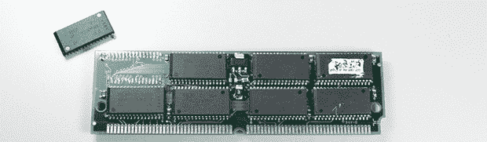

# 用垃圾制作 128MB SIMMs

> 原文：<https://hackaday.com/2013/10/25/making-128mb-simms-from-junk/>

在一家技术维修/回收中心工作，[Jax]可以接触到大量的酷硬件。大部分都是垃圾，但那正是他喜欢的方式。他在科技宝库的深处发现了一个巨大的 64 MB 72 pin SIMMs 防静电包。这些是 90 年代几乎所有东西的标准 RAM 外形，虽然 64 MB 对于当时来说是一个巨大的 RAM 容量，但它们仍然离 128 MB 的 72 引脚最大值有一点距离。

检查完这些棍子后，[Jax]发现了一些奇怪的东西。每一面都有用于存储芯片的焊盘，但是只有一面被填充。考虑到 128 MB 内存的稀有性，[Jax]决定尝试通过拆焊一根内存棒并将其贴在另一根的背面来为这些芯片添加 64 兆内存。

这些新的 128 MB SIMMs 进入 Macintosh Quadra 605 进行测试。虽然 64 MB 芯片工作正常，但新的 128 MB 芯片发出了死亡的钟声。事情非常不对劲。

在调查时，[Jax]找不到任何桥接焊点，一切看起来都没问题。热量是一个很好的测试错误的方法，当 SIMM 连接到电源时，他发现所有新移植的芯片都是热的。因为 SIMMs 背面的芯片本来是要颠倒安装的，[Jax]无意中把地接到了电源，又把电源接到了地。

在一个新的 SIMM 上修复他的错误，[Jax]把它放在他的旧 Mac 上，并再次尝试用这些 SIMM 引导。没有死亡的钟声，但用这些芯片启动需要很长时间。这实际上只是 Mac 检查所有的 RAM，一旦[Jax]最终启动他的操作系统，这个问题就成功解决了。