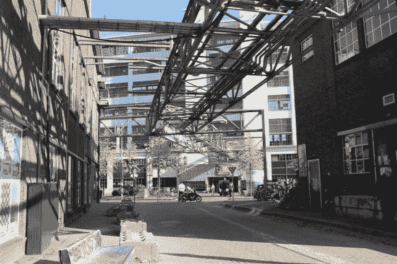
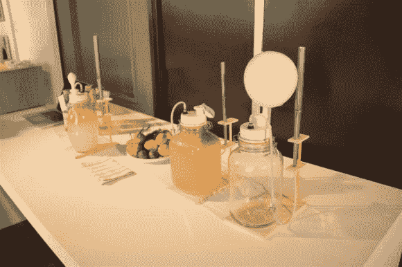

# 欧洲黑客空间:埃因霍温的 MadSpace！

> 原文：<https://hackaday.com/2013/10/30/hackerspacing-in-europe-madspace-in-eindhoven/>

欢迎来到埃因霍温！我们拜访了一些来自 [MadSpace](http://www.madspace.nl/) ( [翻译](http://translate.google.ca/translate?hl=en&sl=nl&u=http://www.madspace.nl/&prev=/search%3Fq%3Dmadspace%26espv%3D210%26es_sm%3D122))的黑客，但不幸的是，他们正在搬家的过程中，在太空中没有什么可看的。幸运的是，我们的访问与[荷兰设计周](http://www.dutchdesignweek.nl/) ( [翻译](http://translate.google.ca/translate?hl=en&sl=nl&u=http://www.dutchdesignweek.nl/&prev=/search%3Fq%3Ddutch%2Bdesign%2Bweek%2Beindhoven%2B2013%26espv%3D210%26es_sm%3D122))相吻合！所以我们还是有一些很酷的东西可以看！

埃因霍温有一段非常有趣的历史。菲利普斯于 19 世纪晚期在这里成立，当时只有一家工厂，但在过去的一个世纪里，它成长为几乎可以称之为菲利普之城的地方。几公里长的菲利普斯式建筑占据了埃因霍温，几乎每个人都为它们工作。快进到现在，大部分的建筑都被卖掉，变成了其他的生意。

有趣的是，没有太多的翻新工作！在城市中漫步就像在工厂中漫步一样。它给人一种很酷的感觉，虽然我想到了“潮人”这个词…

大多数建筑都保持着原始状态，所以有天桥和管道延伸穿过建筑，而当地企业、设计师和艺术家已经在其中开设了商店。

这是一个相当有趣的展示——他们用发酵的水果给气球充气，然后如果你打开阀门，背面的长笛就会演奏一首曲子！

我们采访了一位当地的学生，他已经开始使用自制的铁匠铺进行锻造。

我们来自 MadSpace 的向导[Joris]正在检查一把手工锻造的斧头。

他还参与了一些更严肃的设计项目，比如这个 230 公斤重的工业炉。很高兴看到永恒的东西！

这个项目发现了大规模生产小电路板的最简单的方法——让公众为你制造它们！

很自然的，我们越来越多的来自不同领域的黑客无法抗拒焊接竞赛。

[安东尼]从开放车库领先了！9 个 led、9 个电阻和 1 个电源连接器在几分钟内成功焊接。

重新设计的用于测试电路板的电源。Hack a Day 就在这里！

继续，这是一个非常酷的互动展示。传送带带来不同的食物托盘，如果你把托盘放在槽里…

然后监视器会播放一段视频，讲述食物的历史！

它很可能使用 RFID 标签，但我们从下面看不到太多。

更多这些建筑历史的例子——他们只是留下了这些通道。

我们再次从无效保修中遇到了[Deepak]——在这个地区任何 3D 打印的东西，你都能找到他！他是一座信息之山，我们就 3D 打印的未来进行了一些很好的讨论。

我的同事[Jacob]检查新的 Ultimaker。

看起来相当不错！

遗憾的是，我们错过了真正的 3D 打印展示和活动，所以没什么可看的。

另一个连接建筑的天桥的视图，现在都被封锁了。

一场展示雕像创作步骤的艺术展览。这些是由重新设计的 6 轴工业焊接机器人铣削的巨型泡沫块！

如果这个起飞，这意味着你可以很容易地在后院有一个完整的你自己的雕像，非常便宜！或者我们可以弄一个[巨型黑客日标志……](http://hackaday.com/2013/10/21/pander-to-us-and-win-a-trinket/)

这位年轻的女士正在展示旧技术与新材料的结合。

这种布料是用塑料袋回收的塑料纤维织成的！它有一个有趣的纹理，但很强！

提醒我们为什么没有乐高积木建筑？

我们还被告知要尝尝生鲱鱼——这是荷兰的一道美食。尽管我在第三帧的面部表情很好，但实际上还是相当不错的…

在我们离开之前，我们有机会参观了[本]在大学的实验室。他是微系统的博士，目前正在从事一个非常有趣的项目，涉及到在玻璃上激光蚀刻微特征。除此之外，我们不会试图做更多的解释，所以这是他描述这个项目的网站。

然而，他告诉我们玩这些激光和设置有点像成年人的乐高玩具。他们有一个很大的零件库，所有的零件都可以连接在一起！对[本]来说，这是一份真正理想的工作！

我们本可以花几天时间逛逛荷兰设计周，但不幸的是只有几个小时。有很多很酷的黑客的东西可以看，我们怀疑还有更多我们错过了。特别感谢 MadSpace 的[Ben]和[Joris]带我们参观了这座城市。我们祝你在搬到新的 hackerspace 位置时好运！

其中几张照片归功于[Ben]——我们怀疑你可以根据相框中的人来判断哪些是照片…