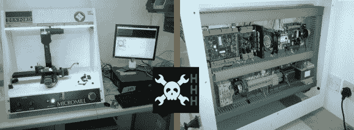

# HHH:嗅探专有数控系统以侵入 g 代码支持

> 原文：<https://hackaday.com/2013/10/25/hhh-sniffing-proprietary-cnc-to-hack-in-g-code-support/>

这是一台漂亮的台式数控铣床，它有一个很大的缺点:它使用专有接口来驱动它。为了增加工具[的灵活性，它被修改为使用 g 代码](http://rlab.org.uk/wiki/CNCMill_Mint)。

该项目是英国阅读黑客空间 rLab 的黑客空间追随者提交的。[Barnaby]休息后解释整个项目。机器本身没有改变，但是在捕获了一堆数据包并制定出协议后，用 Python 编写了一个翻译脚本。这个脚本监听 g 代码，并将其翻译成机器期望接收的命令类型。

如果你从你自己的黑客空间[中知道一个 CNC 黑客，给我们发送这个故事，有机会赢得一些战利品](http://hackaday.com/2013/10/07/hackaday-hackerspace-henchmen-equals-free-stuff-for-you/)。

> Reading Hackspace 收到的第一批工具之一是一台小型但坚固的 3 轴数控铣床。它是为学校使用而设计的，因此是完全封闭的，有许多联锁装置；非常适合训练。尽管它的工作区域有限，但机械很好，有坚固的轴承、NEMA23 电机和 1/2 马力的主轴。正如你从第二张图中看到的，驱动电子线路特别整齐。
> 
> Denford 还提供了一些闭源软件来控制工厂。这个软件是有用的，但是我们想要一些能适应我们需要的东西。我们现在有几台其他机器运行 g 代码(工厂本身与两个 RepRaps 共享一个工作台)，所以似乎很遗憾它被一个专有协议卡住了。
> 
> 一种选择是简单地更换轧机上的控制器。然而，当电流控制器工作时，这似乎是不必要的。另一个有趣的选择是，部分固件可以作为一个全新的基本源文件从主机软件上传。这将允许我们改变一些消息的含义，但是通信消息的实际结构是在别处处理的，所以我们不能添加 g 代码支持。最后，我们启动了 Wine 中的官方软件，并记录了通过串行端口到磁盘的所有通信。
> 
> 事实证明，该协议相对简单，只有带有简单 XOR 校验和的小数据包，通常还有来自工厂的确认。一旦我们意识到有一个固件联锁，你不能移动一个轴，直到它已经回家，这是相当迅速地得到一些基本的运动了轧机。
> 
> 接下来，我们编写了一个简单的 Python 程序，它创建了一个虚拟的串行端口，在这里监听 g 代码，然后将工厂期望的消息发送到真实的串行端口。这允许我们使用与 RepRaps 相同的接口[驱动铣床，并使用](https://github.com/kliment/Printrun) [PyCAM](http://pycam.sourceforge.net/) 生成 g 代码。
> 
> 幸运的 PyCAM 和大多数现代 CAM 程序实际上只输出一个非常简单的 g 代码子集。而不是指定刀具偏移等。它预先计算出所有要移动到的坐标列表。这确保了我们的 g 代码解释器可以非常简单，但仍然可以处理 PyCAM 产生的任何东西。
> 
> 另一件几乎让我们措手不及的事情(到目前为止)，是一些命令(如主轴停止)没有被缓冲，所以你必须轮询轧机，以确保它已经完成了正在进行的切削，然后你才能发送它们。
> 
> 谢谢你，
> 
> 巴纳比

[https://www.youtube.com/embed/QfLBD1is7pw?version=3&rel=1&showsearch=0&showinfo=1&iv_load_policy=1&fs=1&hl=en-US&autohide=2&wmode=transparent](https://www.youtube.com/embed/QfLBD1is7pw?version=3&rel=1&showsearch=0&showinfo=1&iv_load_policy=1&fs=1&hl=en-US&autohide=2&wmode=transparent)