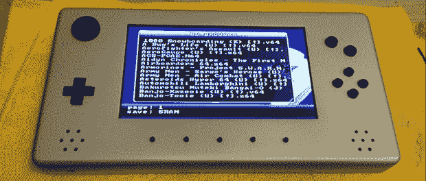
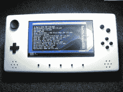
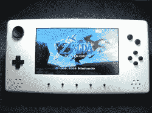
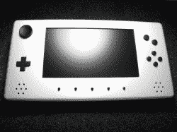
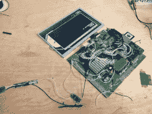

# 铝合金一体式任天堂 64

> 原文：<https://hackaday.com/2013/10/27/aluminum-unibody-nintendo64/>

[Travis]想让我们看看他的 N64 便携式电脑，看看它是否能在 Hackaday 上出现。看起来，我们要说地狱耶。这款便携式 N64 上的所有东西，包括按钮，都是由铝制成的。这是一个惊人的构建，提高了便携式游戏系统的标准。

在这个阳极氧化外壳内是来自原始 N64 的电路板。为了缩小尺寸，[Travis]为 CPU 和 GPU 磨了一个新的散热器。所有的游戏——很可能是所有为 N64 发布的游戏——都存储在 SD 卡上，通过 EverDrive 64 访问。两个 5000 mAh Lipo 电池在漂亮的高分辨率屏幕上提供三个小时的游戏时间。

更令人惊奇的是，[特拉维斯]在一个非常小的，*手动*微型铣床上加工所有零件。真正的便携式游戏机。

你可以看看[Travis]发来的图片和他下面的演示视频。

[https://www.youtube.com/embed/FFdvxd0W7ps?version=3&rel=1&showsearch=0&showinfo=1&iv_load_policy=1&fs=1&hl=en-US&autohide=2&wmode=transparent](https://www.youtube.com/embed/FFdvxd0W7ps?version=3&rel=1&showsearch=0&showinfo=1&iv_load_policy=1&fs=1&hl=en-US&autohide=2&wmode=transparent)

