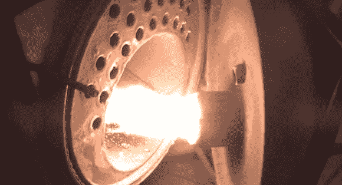

# DIY 颗粒饲料锅炉是热的东西

> 原文：<https://hackaday.com/2013/10/27/diy-pellet-fed-boiler-is-hot-stuff/>

[火行者]设计了一个巨大的颗粒燃烧锅炉 ( [翻译](http://translate.google.com/translate?sl=auto&tl=en&js=n&prev=_t&hl=en&ie=UTF-8&u=http%3A%2F%2Falexkaltsas.wordpress.com%2F2012%2F12%2F13%2Fpellet-burner%2F))。木材和生物质颗粒在过去几年里越来越受欢迎。虽然独立式炉灶是燃烧颗粒最流行的方法，但[火行者]走了一条不同的路。他把一个锅炉从我们认为的石油转换成了颗粒能源。一个 Arduino 控制着这场表演，但不要因此而反对他。[Firewalker]只是把 Arduino 当 AVR 载板用。软件全部用 AVR studio 用 C 写的。控制器的用户界面非常简单。基于两行字符的 LCD 提供状态信息，同时通过按钮输入。一旦系统设置完毕，恒温器就是最终的人机界面。

燃烧小球需要一点准备。每次燃烧前必须对燃烧室进行清理。AVR 被编程来处理这种情况。一旦腔室干净，新的颗粒通过螺旋输送系统送入。燃烧器由标准火焰传感器监控。当火升起来时，颗粒被加入，直到锅炉升温。然后，系统进入待机模式，在这种模式下，它会送入足够的颗粒来维持火焰。当恒温器停止加热时，整个系统关闭，为下一次燃烧做准备。

[https://www.youtube.com/embed/2kZUnNq-lp0?version=3&rel=1&showsearch=0&showinfo=1&iv_load_policy=1&fs=1&hl=en-US&autohide=2&wmode=transparent](https://www.youtube.com/embed/2kZUnNq-lp0?version=3&rel=1&showsearch=0&showinfo=1&iv_load_policy=1&fs=1&hl=en-US&autohide=2&wmode=transparent)