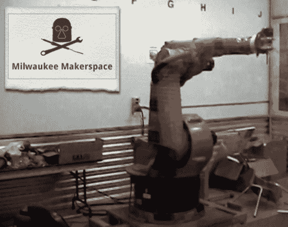

# 黑客空间之旅:密尔沃基创客空间

> 原文：<https://hackaday.com/2013/10/28/hackerspace-tour-milwaukee-makerspace/>

上周四，我有机会参观了密尔沃基的创客空间。我带了一台摄像机，在由[Brant]、[Matt]和[Vishal]带领的[之旅中度过了一段美好的时光。事实上，我们已经看到相当多的知名黑客来自这个群体。我想到的几个例子包括](http://www.youtube.com/watch?v=WMHTAIytLqA)[啤酒自动售货机安全](http://hackaday.com/2011/11/03/beer-security-system-keeps-freeloaders-out-of-your-stash/)和[无瓶水冷却器](http://hackaday.com/2013/05/15/converting-a-bottle-style-water-cooler-to-self-fill-from-the-tap/)。这次旅行展示了太空中许多很酷的东西。不要错过休息后的视频，但如果你想快速浏览，我们也会给你要点:

我们开始参观他们的工艺区、名人墙(包括他们所有的赛车系列奖牌)和激光切割室。从那里我们可以看到一个大房间，用作出租的地板空间和托盘仓库。这部分行程包括参观*红莲*和*大块头杰克-斯坦*，这两部[PRS 赛车在这一季](http://milwaukeemakerspace.org/2013/08/ppprs-detroit-2013/)中使用。储物之旅的最后一站是他们的 19 个储藏室——这些储藏室就像是会员们自己的储藏室。太空用本月最佳跳马奖来增加趣味。

继续前进到下一个大空间，我们遇到了[这个巨大的 Kuka KR 30 工业机器人手臂](http://milwaukeemakerspace.org/2013/06/hello-kuka/)，它们是免费获得的！为了安全起见，在 2500 磅重的野兽周围建了一个房间，他们正在为它建造自己的控制器。现在，它有一个夹具，持有主轴电机，使其成为数控路由器。该外壳位于一个更大的空间内，构成了机械车间和焊接区。穿过一扇门是一个木工车间，里面有一个他们在克雷格清单上看到的大电锯。参观结束时，我们将参观电子产品室和 3D 打印机展示区。

[https://www.youtube.com/embed/WMHTAIytLqA?version=3&rel=1&showsearch=0&showinfo=1&iv_load_policy=1&fs=1&hl=en-US&autohide=2&wmode=transparent](https://www.youtube.com/embed/WMHTAIytLqA?version=3&rel=1&showsearch=0&showinfo=1&iv_load_policy=1&fs=1&hl=en-US&autohide=2&wmode=transparent)