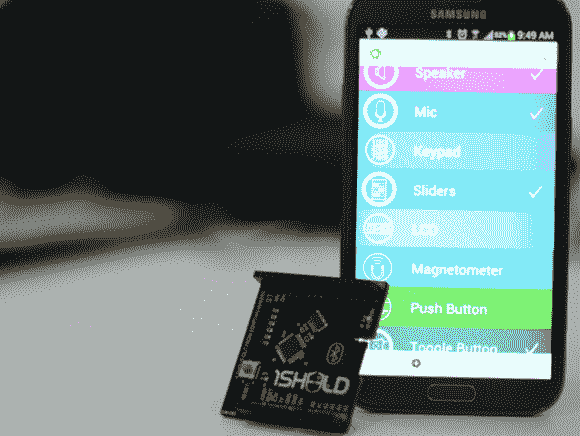

# 1Sheeld 将您的智能手机用作 Arduino 配件

> 原文：<https://hackaday.com/2013/10/29/1sheeld-uses-your-smartphone-as-an-arduino-accessory/>

Arduino 有点像网关板。你从一个 Uno 开始，然后是一个盾，然后是另一个。在你意识到之前，你已经收集了一整套盾牌。这就是 1Sheeld 想要解决的问题[。1Sheeld 允许您将手机用作 Arduino 的传感器和 I/O 套件，取代许多现有的屏蔽。我们认为这将是一个伟大的想法，特别是与所有的老手机合同到期这些天。普通智能手机的传感器功能，以及 LCD 和触摸屏 I/O 功能可能会成为有趣的配对。](http://techcrunch.com/2013/10/28/hey-arduino-fans-1sheeld-lets-your-smartphone-act-as-many-different-arduino-shields/)

[目前，1Sheeld 页面只是一个即将到来的 kickstarter](http://1sheeld.com/) 的注册，它留下了许多想象的细节。看起来 1Sheeld 将是基于蓝牙的板。不过，仍有几个问题需要回答——1 号门将使用[的安卓 ADK](http://developer.android.com/tools/adk/index.html) 吗？软件就是我们等着看的东西。运行在 1Sheeld 模块蓝牙芯片中的软件将是重要的，但运行在手机端的软件将是该模块的真正成败所在。我们希望看到更多的智能手机被用于硬件黑客，而不是在被替换后收集灰尘。

[Via [TechCrunch](http://techcrunch.com/2013/10/28/hey-arduino-fans-1sheeld-lets-your-smartphone-act-as-many-different-arduino-shields/)