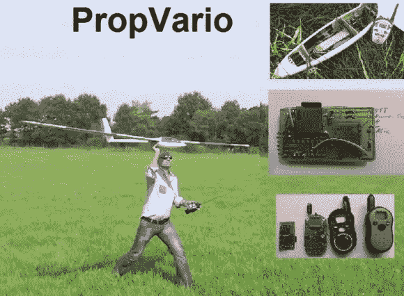

# 遥控滑翔机用的会说话的变距仪/高度计

> 原文：<https://hackaday.com/2013/10/30/propvario-a-talking-variometeraltimeter-for-rc-sailplanes/>

抬起来。对于一名滑翔机飞行员来说，这意味着是享受一次放松的飞行，还是寻找一片开阔的地方着陆。然而，寻找电梯并不总是容易的。尤其是当滑翔机在离飞行员数百米的高空时，飞行员的双脚牢牢地踩在地面上。这就是为什么[Tharkun]创造了 PropVario。PropVario 是无线电控制的滑翔机的组合式变距仪和高度计。我们已经在[见过几个](http://hackaday.com/2009/10/10/diy-cell-phone-alti-variometer/)变距仪[，](http://hackaday.com/2012/11/15/variometer-build-for-gliding-aircraft/)最常见于全尺寸滑翔机或悬挂式滑翔机飞行员。几乎每架全尺寸飞机都有一个[变仪](http://en.wikipedia.org/wiki/Variometer)作为其仪表套件的一部分——通常称为爬升率或垂直速度指示器。

尽管如此，遥控飞机的飞行员在飞行时却没有看仪表的奢侈。在这样的高度，即使是 2 米长的大型滑翔机，肉眼也只能看到一个小点。因为你在检查仪表而看不见你的滑翔机会有点尴尬。解决方案其实很简单。变化的音频音调指示飞机的爬升率。音调较高意味着飞机正在上升。音调较低意味着飞机正在下降。这个系统，加上一个简单的无线电发射机，已经被遥控滑翔机飞行员使用了多年。

[Tharkun]决定将事情发展到下一个阶段——为高度增加语音输出。他从一个视差推进器和一个 MS5611 压力传感器开始。压力传感器是确定高度的好选择。即使在今天的全球定位系统的世界里，气压仍然是商业喷气式飞机高度测量的黄金标准。microSD 卡提供了语音输出的样本，使项目的高度计部分易于适应任何语言。最后，一个标准的家庭无线电服务无线电被黑客攻击来创建下行链路。使用 PropVaro 就像听音调和语音读数一样简单。干得好[塔尔昆]！我们希望你所有的航班都充满了足够的热量！

[https://www.youtube.com/embed/jUx2i1AsTH4?version=3&rel=1&showsearch=0&showinfo=1&iv_load_policy=1&fs=1&hl=en-US&autohide=2&wmode=transparent](https://www.youtube.com/embed/jUx2i1AsTH4?version=3&rel=1&showsearch=0&showinfo=1&iv_load_policy=1&fs=1&hl=en-US&autohide=2&wmode=transparent)